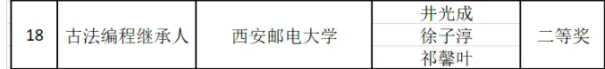
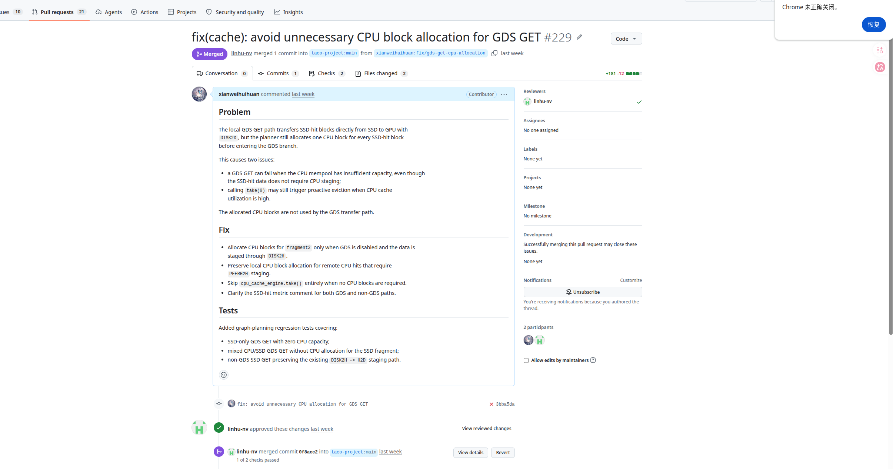
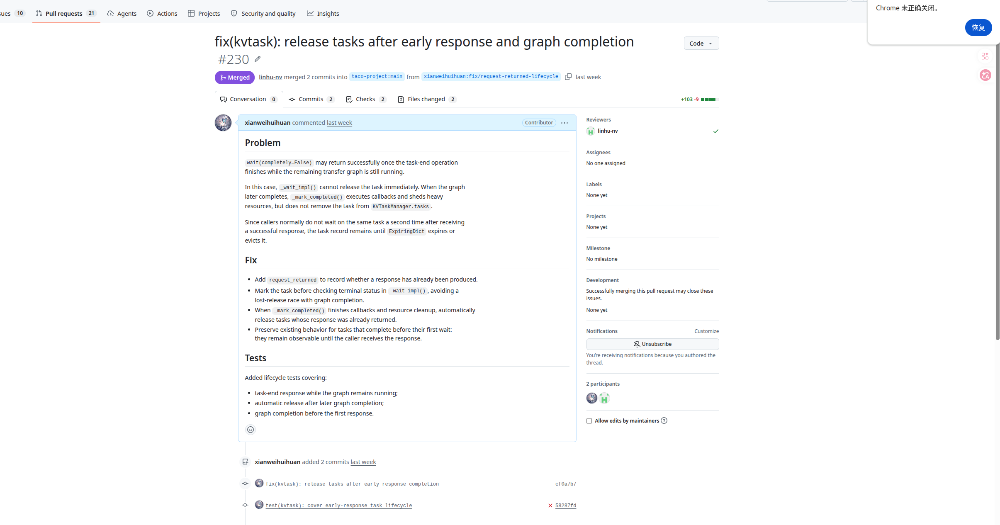

# MiniFlex：面向 LLM 推理负载的 KV Cache 分层管理与优化系统

| 项目 | 内容 |
| --- | --- |
| 赛题 | proj21——面向AI推理负载的异构存储管理系统优化 |
| 比赛名称 | 2026全国大学生计算机系统能力大赛操作系统设计赛全国总决赛（功能挑战赛道） |
| 比赛成绩 | 国家二等奖 |
| 参赛队伍 | 古法编程继承人 |
| 团队成员 | 井光成、徐子淳、祁馨叶 |
| 参赛学校 | 西安邮电大学 |

## 竞赛成果

本项目参加 **2026全国大学生计算机系统能力大赛操作系统设计赛全国总决赛功能挑战赛道**，围绕“面向 AI 推理负载的异构存储管理系统优化”赛题完成系统设计、工程实现与场景化验证，最终获得 **国家二等奖**。

比赛版本完成了 vLLM V1 Connector 透明接入、GPU / CPU / SSD 三级 KV Cache 管理、C++/CUDA 跨层传输、`io_uring` SSD I/O，以及长上下文、超显存工作集和真实 SSD 回填链路的端到端验证。代表性结果包括：

- 约 `30k` 上下文命中回填加速约 `9.83×`；
- 约 `105k` 超显存工作集下保持 `0% miss`；
- 在保留推理框架主流程的前提下，实现 KV Cache 的跨层组织、迁移、回填与复用。



> 获奖名单显示：西安邮电大学“古法编程继承人”团队，成员为井光成、徐子淳、祁馨叶。

## 目录

- [竞赛成果](#竞赛成果)
- [一、项目概述](#一项目概述)
- [二、项目亮点](#二项目亮点)
- [三、核心文件说明](#三核心文件说明)
- [四、系统设计与实现内容](#四系统设计与实现内容)
- [五、阶段性结果](#五阶段性结果)
- [六、快速启动](#六快速启动)
- [七、测试与演示](#七测试与演示)
- [八、仓库结构](#八仓库结构)
- [九、当前边界与后续规划](#九当前边界与后续规划)
- [十、合规与说明](#十合规与说明)

## 一、项目概述

MiniFlex 是一个面向大语言模型推理场景的 KV Cache 分层管理系统，重点解决 **长上下文、显存受限、工作集超过 GPU 容量** 时推理效率快速下降的问题。项目以 vLLM V1 KV connector 为接入边界，在尽量少改动推理框架主流程的前提下，实现 KV Cache 在 **GPU / CPU / SSD** 多层介质之间的组织、迁移、回填与复用。

项目当前聚焦以下目标：

- 在长上下文场景下降低 prefill 重算开销；
- 在超显存容量场景下维持更稳定的命中能力；
- 通过透明接入方式降低工程改造成本；
- 提供可复现的测试、验证与展示材料；
- 形成适合比赛提交的设计文档、使用说明和验证记录。

从问题定位上看，MiniFlex 围绕 **KV Cache 生命周期管理** 这一关键瓶颈，构建一个可插拔、可扩展、可验证的分层缓存系统。

## 二、项目亮点

### 2.1 透明接入现有推理框架

MiniFlex 基于 vLLM 的 KV connector 机制实现接入，尽量保留原有推理主流程，不要求大规模侵入式改造，便于工程集成与后续演示。

### 2.2 面向操作系统问题的分层存储设计

项目围绕 GPU、CPU、SSD 三层存储介质构建统一缓存视图，将“显存不足”问题转化为“跨层存储调度与回填”问题，突出操作系统中的资源管理、分层存储、缓存替换与 I/O 路径优化能力。

### 2.3 兼顾性能与容量稳定性

MiniFlex 的核心价值不只是追求容量内最快，其在追求 **越过 GPU 显存边界之后退化更平稳**。在工作集超出 GPU KV 容量时，相比原生 APC 路径更能维持稳定命中和较低时延。

### 2.4 具备完整工程化材料

项目提供：

- 启动脚本；
- 一键演示脚本；
- 长上下文 / 超容量 / 混合负载基准；
- 使用说明、结构说明、验证文档；
- 测试总览与 AI 工具使用记录。

## 三、核心文件说明

### 文档内容

- [设计开发文档.md](./设计开发文档.md)：比赛主设计开发文档；
- [决赛PPT.pdf](./决赛PPT.pdf)：项目答辩与展示材料；
- [miniflex/docs/ssd_e2e.md](./miniflex/docs/ssd_e2e.md)：真实 SSD 命中与 CPU 回填验证说明；
- 项目演示视频 `Miniflex决赛演示视频.mp4`：百度网盘链接 `https://pan.baidu.com/s/1gxsgdjKFHkzfQ0OKDU27dg?pwd=8c4h`，提取码 `8c4h`。

## 四、系统设计与实现内容

### 4.1 分层缓存管理

- 支持将 KV Cache 作为 block 级资源进行组织；
- 在 GPU / CPU / SSD 之间维护统一缓存管理视图；
- 支持缓存命中、写入、回填与状态管理；
- 支持跨层 GET / PUT 路径规划与缓存状态维护。

### 4.2 透明接入 vLLM

- 基于 vLLM V1 connector 接入；
- 尽量保留原有推理主流程；
- 通过 scheduler / worker 两侧协同完成 KV 生命周期接管；
- 兼容 OpenAI 接口风格的服务启动与验证方式。

### 4.3 底层传输与工程化支持

- 提供 GPU ↔ CPU 的 C++ / CUDA 传输实现；
- 提供 CPU ↔ SSD 的 `io_uring` 传输后端；
- 补充可选 GDS SSD ↔ GPU 直连传输后端的原型实现；当前尚未接入主线逻辑，主线仍只有 SSD → CPU → GPU 回填路径；
- 提供启动脚本、演示脚本和基准测试脚本；
- 支持以环境变量方式进行缓存容量和行为调优。

### 4.4 场景化验证

- 长上下文加速验证；
- 超容量工作集验证；
- 混合负载验证；
- 功能正确性与稳定性验证。

### 4.5 当前完成情况

| 预期方向 | 当前状态 | 说明 |
| :-- | :-- | :-- |
| vLLM 接入路径 | 已完成 | 已打通基于 connector 的透明接入 |
| CPU 缓存层 | 已完成 | 已支持 CPU 层缓存命中与回填 |
| SSD 缓存层 | 已完成 | 已支持 SSD 侧存储与读取路径 |
| GPU ↔ CPU 传输 | 已完成 | 已提供 C++ / CUDA 扩展实现 |
| CPU ↔ SSD 传输 | 已完成 | 已提供 `io_uring` 后端 |
| 可选 GDS 直连后端 | 原型实现 | 已补充 `DISK2D` / `D2DISK`、`GDSIOCTX` 与 `GDSTransferWorker`，但尚未接入主要逻辑；当前可验证主线仍只有 SSD → CPU → GPU 回填路径 |
| SSD E2E 验证 | 已完成 | 已补充真实服务中的 SSD 持久化、恢复与 CPU 回填验证 |
| 结构文档与使用说明 | 已完成 | 已整理结构、使用与验证文档 |
| 长上下文 / 容量测试 | 已完成 | 已形成阶段性实验结果 |


## 五、阶段性结果

### 5.1 长上下文加速

在当前实验结果中，随着上下文长度增长，MiniFlex 命中后的回填路径可以显著减少 prefill 重算：

- `~1k` 上下文：约 `1.67×` 加速；
- `~8k` 上下文：约 `4.67×` 加速；
- `~30k` 上下文：约 `9.83×` 加速。

代表性结果：`~30k` 上下文下，冷启动约 `3858.0 ms`，命中回填后约 `392.4 ms`。

### 5.2 超容量场景优势

与 vLLM 原生 APC 相比，MiniFlex 在“工作集超出 GPU KV 容量”后表现更稳定：

| 工作集 | APC | MiniFlex |
| --- | --- | --- |
| `~45k` | `57 ms / 0% miss` | `110 ms / 0% miss` |
| `~75k` | `654 ms / 100% miss` | `149 ms / 0% miss` |
| `~105k` | `707 ms / 100% miss` | `158 ms / 0% miss` |

这说明 MiniFlex 的核心价值不在于容量内峰值最快，而在于 **越过显存边界后退化更平稳**。

## 六、快速启动

更完整的环境说明、配置说明与常见问题见 `miniflex/docs/usage.md`。

如果只是想快速拉起项目并验证功能，建议按下面步骤进行。

### 6.1 环境前提

推荐环境：

- Linux 环境；
- Python `>= 3.10`；
- 已正确安装 PyTorch；
- 使用 vLLM connector 时安装 `vllm`；
- 系统安装 `liburing-dev`（SSD I/O 后端需要）。

安装系统依赖：

```bash
sudo apt install liburing-dev
```

安装项目：

```bash
cd miniflex

# 在已装好 torch 的环境里安装
pip install --no-build-isolation .

# 若需要通过 vLLM connector 启动
pip install --no-build-isolation '.[vllm]'
```

### 6.2 方式一：使用封装脚本启动

最推荐直接使用仓库内已封装好的启动脚本：

```bash
cd miniflex
bash run_vllm_miniflex.sh
```

该脚本会完成：

- 清理上一次残留的 vLLM / EngineCore 进程；
- 清理旧的 IPC socket；
- 设置 MiniFlex 所需环境变量；
- 启动带 MiniFlex connector 的 vLLM 服务。

可用环境变量覆盖常见参数：

```bash
MODEL=Qwen/Qwen3-8B \
PORT=8000 \
MINIFLEX_MAX_MODEL_LEN=32768 \
MINIFLEX_GPU_MEM_UTIL=0.80 \
bash run_vllm_miniflex.sh
```

### 6.3 方式二：手动启动 vLLM + MiniFlex

如果需要手动调试，可以直接运行：

```bash
cd miniflex

export ENABLE_MINIFLEX=1
export PYTHONPATH=pysrc
export MINIFLEX_GPU_REGISTER_PORT=ipc:///tmp/miniflex.sock

vllm serve <你的模型名> \
  --served-model-name qwen3-8b \
  --kv-transfer-config '{"kv_connector":"MiniFlexConnectorV1","kv_connector_module_path":"miniflex.integration.vllm.connector","kv_role":"kv_both"}' \
  --disable-hybrid-kv-cache-manager \
  --no-enable-prefix-caching \
  --gpu-memory-utilization 0.80 \
  --max-model-len 2048 \
  --enforce-eager \
  --port 8000
```

注意事项：

- `--kv-transfer-config` 的 JSON 必须写在同一行；
- 单机单卡场景下必须加 `--disable-hybrid-kv-cache-manager`；
- 启动目录建议为 `miniflex/`，并确保 `PYTHONPATH=pysrc`。

### 6.4 服务验证

服务启动成功后，可通过 OpenAI 兼容接口验证：

```bash
curl -s http://localhost:8000/v1/completions \
  -H 'Content-Type: application/json' \
  -d '{"model":"qwen3-8b","prompt":"The capital of France is","max_tokens":12,"temperature":0}'
```

### 6.5 常见入口

- 启动脚本：`run_vllm_miniflex.sh`
- 一键演示：`demo.sh`
- SSD E2E：`bench_ssd_e2e.py`
- 使用说明：`miniflex/docs/usage.md`
- 结构说明：`miniflex/docs/project_structure.md`
- 验证报告：`miniflex/docs/validation.md`

## 七、测试与演示

### 7.1 一键演示

项目提供自包含演示脚本，可自动完成功能验证、长上下文测试、容量交叉测试、混合负载测试和 SSD E2E 测试：

```bash
cd miniflex
bash demo.sh
```

若不需要每幕暂停：

```bash
cd miniflex
PAUSE=0 bash demo.sh
```

第二幕长上下文基准可通过 `TTFT_RUNS` 控制每个上下文的正式采样次数；真实 SSD E2E 验证会在第五幕覆盖 `CPU 淘汰 -> SSD 命中 -> CPU 回填 -> GPU 恢复` 路径。

### 7.2 单项基准测试

长上下文 TTFT：

```bash
cd miniflex
PYTHONPATH=pysrc python bench_ttft.py --url http://localhost:8000 --model qwen3-8b --body-repeat 1000 --runs 10
```

超容量工作集：

```bash
cd miniflex
PYTHONPATH=pysrc python bench_overflow.py --url http://localhost:8000 --tag miniflex --num-prefixes 10
```

混合负载：

```bash
cd miniflex
PYTHONPATH=pysrc python bench_mixed.py --url http://localhost:8000 --tag both
```

SSD E2E：

```bash
cd miniflex
PYTHONPATH=pysrc python bench_ssd_e2e.py --url http://localhost:8000 --model qwen3-8b
```

### 7.3 测试材料位置

- 测试总览与 AI 交互记录：`miniflex/docs/test_overview.md`
- 验证报告：`miniflex/docs/validation.md`
- 测试代码目录：`miniflex/test/`

## 八、仓库结构

```text
xiyoulinux-kvcache-optimizer/
├── README.md
├── 设计开发文档.md
├── image/                     # 说明图、PR 截图等展示材料
├── miniflex/
│   ├── csrc/                  # C++ / CUDA 扩展
│   ├── docs/                  # 结构说明、使用说明、验证报告等
│   ├── pysrc/miniflex/        # Python 主体实现
│   ├── test/                  # 单元测试与功能验证
│   ├── bench_ttft.py          # 长上下文 TTFT 测试
│   ├── bench_overflow.py      # 超容量工作集测试
│   ├── bench_mixed.py         # 混合负载测试
│   ├── bench_ssd_e2e.py       # SSD 持久化与 CPU 回填测试
│   ├── demo.sh                # 一键演示脚本
│   ├── run_vllm_miniflex.sh   # 启动 vLLM + MiniFlex 脚本
│   ├── pyproject.toml
│   └── setup.py
└── 归档-日志-调研-测试/         # 历史测试、调研材料与归档脚本
```

### 8.1 核心代码说明

- `miniflex/pysrc/miniflex/integration/vllm/connector.py`：MiniFlex 接入 vLLM 的入口；
- `miniflex/pysrc/miniflex/kvtask.py`：KV 任务组织与编排；
- `miniflex/pysrc/miniflex/cache/`：逻辑缓存管理；
- `miniflex/pysrc/miniflex/storage/`：物理存储与分配；
- `miniflex/pysrc/miniflex/transfer/`：传输调度与 worker；
- `miniflex/csrc/transfer.cu`：GPU ↔ CPU 传输实现；
- `miniflex/csrc/ssd_io_uring.cpp`：SSD I/O 后端实现；
- `miniflex/csrc/gds_io.cpp`：可选 GDS SSD ↔ GPU 直连传输后端原型实现；当前尚未接入主要逻辑，主线仍使用 SSD → CPU → GPU。


## 九、当前边界与后续规划

### 9.1 当前版本边界

- 当前版本仅支持 **单机单卡**；
- 当前外部缓存层以 **CPU + SSD** 为主；
- 不涉及分布式远端 KV 服务；
- 不覆盖 TP、DP、多实例协同等复杂部署模式；
- 当前更关注功能可行性、路径正确性与容量退化稳定性。

### 9.2 后续可扩展方向

- 多卡 / 分布式 KV 协同；
- 更细粒度的缓存替换与热度管理策略；
- 更高性能的跨层异步调度；
- 更完备的自动化评测与可视化展示。

## 十、合规与说明

### 10.1 参考项目研究与社区协作

在参考开源项目研究过程中，我们不仅阅读源码和学习设计，也参与了该开源项目中的问题定位、修复与讨论。下面记录的是对参考开源项目的公开社区协作情况，用于如实说明调研和贡献过程；这些 PR / Issue 属于开源项目本身，与 MiniFlex 的项目实现边界分开说明。

相关公开记录可概括如下：

| 类型 | 编号 | 主题 | 作用概述 |
| :-- | :-- | :-- | :-- |
| PR（已合并） | `#184` | batch task 生命周期泄漏修复 | 修复批量合并后子任务未及时回收的问题，完善任务生命周期管理 |
| PR（已合并） | `#176` | match / put 条件不满足时立即取消 KVTask | 避免异常路径下任务残留导致的内存泄漏 |
| PR（已合并） | `#174` | `_set_slot_mapping_impl` 中更新 `task.slot_mapping` | 修复批量任务映射信息未同步更新导致的错误合并 |
| PR（已合并） | `#173` | `SharedOpPool.allocate_slot` 临界区加锁修复 | 将关键状态更新移入锁内，消除竞态条件 |
| PR（已合并） | `#172` | `TransferWorker.run()` 批处理循环中的 shutdown 处理 | 完善 worker 退出逻辑，确保清理路径能够正确执行 |
| PR（已合并） | `#166` | `Mempool.recycle_blocks` block id 范围校验 | 补充边界检查，提升异常输入下的健壮性 |
| PR（已合并） | `#187` | vLLM 0.23+ non-MLA `LAYERBLOCK` 兼容适配 | 适配新版本 vLLM 的 GPU KV layout 变化，保证传输与布局正确性 |
| PR（已合并） | `#229` | GDS GET 资源规划修复 | 针对参考开源项目已有的本地 GDS GET 路径，修复 SSD 命中直达 GPU 时仍冗余申请 CPU block 的问题 |
| PR（已合并） | `#230` | early response 后 KVTask 生命周期释放修复 | 修复 task-end response 已返回但 transfer graph 后续完成时任务未释放的问题，避免任务表与中间资源长期滞留 |
| Issue（已修复） | `#161` | `FLEXKV_SYNC_GET=1` 同步路径任务字典未清理 | 报告同步 GET 等待完成后 `req_id_to_task_dict` 未清理、导致后续 PUT 任务无法创建的问题；该问题后续由非本队 PR `#162` 修复后关闭 |

部分 PR 工作示例如下：

| PR #229：GDS GET 资源规划修复 | PR #230：early response 后 KVTask 生命周期释放修复 |
| :--: | :--: |
|  |  |

比赛提交要求中的设计文档、非本队来源说明、开源协议状态说明、AI 工具使用说明等内容，统一整理在以下文档中：

- `设计开发文档.md`
- `miniflex/docs/test_overview.md`

