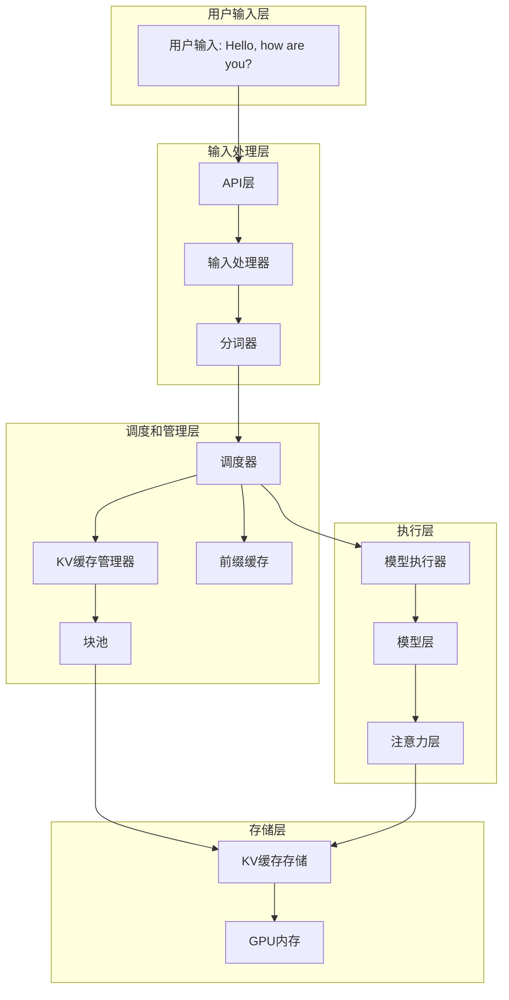
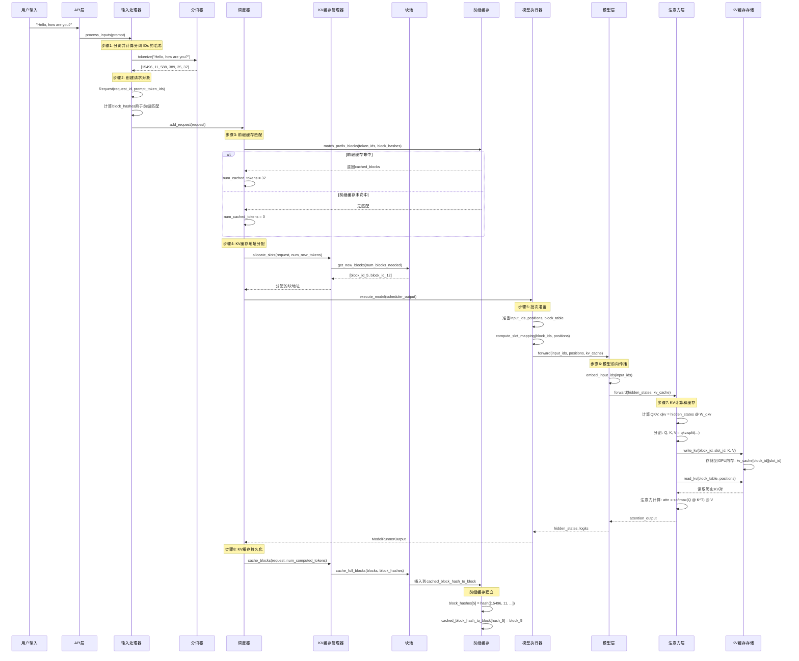

# vLLM KV Cache 工作机制详解

本文档详细说明了vLLM中从用户输入请求到KV cache被缓存和复用的完整流程，包括向量化、地址分配、缓存复用等核心机制。

## 目录

1. [完整流程概览](#1-完整流程概览)
2. [详细步骤解析](#2-详细步骤解析)
3. [Token的复用机制](#3-相同token的复用机制)
4. [实际应用示例](#4-实际应用示例)
5. [性能优化技术](#5-性能优化技术)
6. [总结](#6-总结)

## 1. 完整流程概览

### 1.1 系统架构



### 1.2 核心数据流程



## 2. 详细步骤解析

### 2.1 计算 token IDs

#### 核心代码位置

- **输入处理器**: `vllm/v1/engine/input_processor.py:195`
- **文本分词**: `vllm/inputs/preprocess.py:68`

#### 为什么要进行Token化？

**原理和动机：**

1. **计算机处理基础**: 大语言模型无法直接理解人类语言文本，需要将文本转换为数字序列
2. **语义表示**: Tokenization将文本切分为有意义的语义单元（token），每个token对应一个唯一的ID
3. **效率优化**: 相比字符级处理，tokenization减少了序列长度，提高计算效率
4. **模型兼容性**: 统一使用预训练tokenizer确保与模型训练时的表示一致

**为什么使用特定的Tokenizer：** 

- **词汇表匹配**: 使用与模型训练时相同的tokenizer，确保token ID映射一致
- **多语言支持**: 现代tokenizer支持多种语言和特殊字符
- **子词处理**: 采用BPE/WordPiece等算法处理OOV（Out of Vocabulary）问题

#### 详细实现

```python
def process_inputs(
        self,
        request_id: str,                # 请求唯一ID
        prompt: PromptType | EngineInput, # 用户输入的提示词（支持原始文本/预处理后格式）
        params: SamplingParams | PoolingParams, # 生成/池化参数（文本生成用采样参数，嵌入用池化参数）
        supported_tasks: tuple[SupportedTask, ...], # 模型支持的任务类型（生成/嵌入等）
        arrival_time: float | None = None, # 请求到达时间
        lora_request: LoRARequest | None = None, # LoRA微调模型请求
        tokenization_kwargs: dict[str, Any] | None = None, # 分词器参数
        trace_headers: Mapping[str, str] | None = None, # 链路追踪头
        priority: int = 0, # 请求优先级
        data_parallel_rank: int | None = None, # 数据并行秩（分布式推理用）
        resumable: bool = False, # 是否支持断点续跑
    ) -> EngineCoreRequest: # 返回值：引擎核心标准请求对象
    # 1. 参数合法性校验：校验生成/池化参数是否匹配模型支持的任务
    self._validate_params(params, supported_tasks)
    # 校验LoRA请求是否合法（是否存在、配置是否正确）
    self._validate_lora(lora_request)

    # 2. 分布式推理配置校验：获取数据并行相关配置
    parallel_config = self.vllm_config.parallel_config
    dp_size = parallel_config.data_parallel_size
    dp_local_size = parallel_config.data_parallel_size_local
    # 确定总并行秩数量（仅本地引擎/全局引擎）
    num_ranks = dp_local_size if parallel_config.local_engines_only else dp_size
    # 校验数据并行秩是否在合法范围 [0, num_ranks)
    if data_parallel_rank is not None and not (0 <= data_parallel_rank < num_ranks):
        raise ValueError(
            f"data_parallel_rank {data_parallel_rank} "
            f"is out of range [0, {num_ranks})."
        )

    # 3. 兼容处理：区分新版（字典格式）和旧版（原始文本）输入提示词
    if isinstance(prompt, dict) and "type" in prompt:
        # 新版输入：已经通过Renderer预处理的字典格式（推荐用法）
        # 废弃警告：tokenization_kwargs参数将在v0.18移除
        if tokenization_kwargs:
            logger.warning_once(
                "Passing tokenization_kwargs to InputProcessor is deprecated "
                "and will be removed in v0.18. You should instead pass "
                "them to Renderer.render_cmpl() or Renderer.render_chat()."
            )
        # 未指定到达时间时，从输入字典获取或取当前时间
        if arrival_time is None:
            arrival_time = prompt.get("arrival_time", time.time())
        # 直接使用预处理后的输入
        processed_inputs: EngineInput = prompt

    else:
        # 旧版输入：原始文本提示词（不推荐，即将废弃）
        logger.warning_once(
            "Passing raw prompts to InputProcessor is deprecated "
            "and will be removed in v0.18. You should instead pass "
            "the outputs of Renderer.render_cmpl() or Renderer.render_chat()."
        )
        # 未指定到达时间时，取当前系统时间
        if arrival_time is None:
            arrival_time = time.time()
        # 调用预处理器：将原始文本分词、编码，转换为引擎可识别格式
        processed_inputs = self.input_preprocessor.preprocess(
            prompt,
            tokenization_kwargs=tokenization_kwargs,
        )

    # 4. 平台级请求校验：验证输入和参数是否符合当前部署平台要求
    current_platform.validate_request(processed_inputs, params)

    # 5. 拆分编码器-解码器输入：区分编码任务（如嵌入）和解码任务（如文本生成）
    encoder_inputs, decoder_inputs = split_enc_dec_input(processed_inputs)
    # 校验模型输入格式是否合法
    self._validate_model_inputs(encoder_inputs, decoder_inputs)

    # 6. 提取核心输入数据：分词ID/嵌入向量（二选一）
    # 处理联合类型，简化后续访问逻辑
    if decoder_inputs["type"] == "embeds":
        # 输入为嵌入向量（无分词ID）
        prompt_token_ids = None
        prompt_embeds = decoder_inputs["prompt_embeds"]
    else:
        # 输入为文本分词后的ID序列（无嵌入向量）
        prompt_token_ids = decoder_inputs["prompt_token_ids"]
        prompt_embeds = None

    # 7. 处理推理参数：区分文本生成/特征池化任务
    sampling_params = None
    pooling_params = None
    if isinstance(params, SamplingParams):
        # 文本生成任务：克隆采样参数（避免修改原始对象）
        sampling_params = params.clone()
        # 未设置max_tokens时，自动计算最大生成长度（模型最大长度-提示词长度）
        if sampling_params.max_tokens is None:
            seq_len = length_from_prompt_token_ids_or_embeds(
                prompt_token_ids, prompt_embeds
            )
            sampling_params.max_tokens = self.model_config.max_model_len - seq_len

        # 从模型生成配置、分词器更新参数（结束符、停止词等）
        sampling_params.update_from_generation_config(
            self.generation_config_fields,
            self.renderer.get_eos_token_id(),
        )
        if self.tokenizer is not None:
            sampling_params.update_from_tokenizer(self.tokenizer)
    else:
        # 特征池化任务（如文本嵌入）：克隆池化参数
        pooling_params = params.clone()

    # 8. 多模态数据处理（图片/音频等多模态输入）
    mm_features: list[MultiModalFeatureSpec] | None = None
    if decoder_inputs["type"] == "multimodal":
        # 提取多模态输入、占位位置、哈希值
        decoder_mm_inputs = decoder_inputs["mm_kwargs"]
        decoder_mm_positions = decoder_inputs["mm_placeholders"]
        decoder_mm_hashes = decoder_inputs["mm_hashes"]

        # 校验多模态哈希值必须为字符串（合法性校验）
        if not all(
            isinstance(leaf, str) for leaf in json_iter_leaves(decoder_mm_hashes)
        ):
            raise ValueError(
                f"mm_hashes must contain only strings, got: {decoder_mm_hashes}. "
                "This is likely due to an incorrect custom implementation of "
                "MultiModalProcessor.apply method."
            )

        # 按输入序列位置排序多模态数据（保证顺序正确）
        sorted_mm_idxs = argsort_mm_positions(decoder_mm_positions)

        # 封装多模态特征为标准对象
        mm_features = []
        for modality, idx in sorted_mm_idxs:
            base_mm_hash = decoder_mm_hashes[modality][idx]
            mm_features.append(
                MultiModalFeatureSpec(
                    data=decoder_mm_inputs[modality][idx], # 多模态原始数据
                    modality=modality, # 模态类型（图片/音频）
                    identifier=self._get_mm_identifier(
                        base_mm_hash,
                        lora_request,
                    ), # 唯一标识（用于缓存）
                    mm_position=decoder_mm_positions[modality][idx], # 在文本中的位置
                    mm_hash=base_mm_hash, # 哈希值
                )
            )

    # 9. 封装最终请求：将所有预处理后的数据打包为引擎核心请求对象
    return EngineCoreRequest(
        request_id=request_id,
        prompt_token_ids=prompt_token_ids,  # 提示词分词ID
        prompt_embeds=prompt_embeds,        # 提示词嵌入向量
        mm_features=mm_features,            # 多模态特征
        sampling_params=sampling_params,    # 文本生成参数
        pooling_params=pooling_params,      # 池化/嵌入参数
        arrival_time=arrival_time,          # 请求到达时间
        lora_request=lora_request,          # LoRA请求
        cache_salt=decoder_inputs.get("cache_salt"), # 缓存盐值
        priority=priority,                  # 请求优先级
        data_parallel_rank=data_parallel_rank, # 分布式秩
        trace_headers=trace_headers,        # 追踪头
        resumable=resumable,                # 是否断点续跑
    )
```

#### 关键数据结构

```python
class Request:
    def __init__(self, request_id, prompt_token_ids, block_hasher):
        # 原始token序列
        self.prompt_token_ids = prompt_token_ids  # [15496, 11, 588, 389, 35, 32]
        
        # 所有token序列（包括输入和输出）
        self.all_token_ids = prompt_token_ids.copy()
        
        # Block级别的hash用于前缀缓存匹配
        if block_hasher:
            self.block_hashes = block_hasher(self)
        
        # 已计算的token数量
        self.num_computed_tokens = 0
        
        # 前缀缓存命中的token数量
        self.num_cached_tokens = -1
```

### 2.2 Block Hash计算

#### 为什么要计算Block Hash？

**原理和动机：**

1. **快速查找**: 通过hash值可以快速判断两个请求是否有相同的前缀，避免逐个token比较
2. **内存效率**: 只需存储hash值（几十字节）而非完整的token序列（可能很大）
3. **前缀共享**: 识别可以复用的KV cache块，避免重复计算
4. **缓存管理**: 基于hash的缓存系统，支持高效的插入、查找和删除操作

**为什么选择Hash而非直接比较：**

- **时间复杂度**: Hash查找O(1) vs 逐token比较O(n)
- **空间复杂度**: Hash值固定长度 vs token序列变长
- **并发安全**: Hash值不可变，适合多线程环境

#### Hash计算策略

vLLM使用分层hash策略来支持前缀缓存，并提供多种hash算法选择：

```python
def compute_block_hashes(request, block_size=16):
    """计算每个block的hash值"""

    block_hashes = []
    token_ids = request.all_token_ids

    # 将token序列按block_size分组
    for i in range(0, len(token_ids), block_size):
        block_tokens = token_ids[i:i + block_size]

        # 计算该block的hash
        # vLLM支持多种hash算法：
        # 1. sha256_cbor: SHA256 + CBOR编码（高安全性，默认）
        # 2. xxhash_cbor: XXHash + CBOR编码（高性能）
        block_hash = hash_function(block_tokens)
        block_hashes.append(block_hash)

    return block_hashes

# 示例：
# 输入: [15496, 11, 588, 389, 35, 32]
# block_size = 16
# 输出: [hash([15496, 11, 588, 389, 35, 32])]
```

#### 具体实现方式

**Hash算法选择：**

```python
# vLLM支持两种主要hash算法：

# 1. SHA256 + CBOR (默认)
def sha256_cbor(data):
    """使用SHA256哈希算法 + CBOR编码"""
    import hashlib
    import cbor2

    # CBOR编码：将数据结构转为二进制格式
    encoded_data = cbor2.dumps(data)

    # SHA256哈希：生成256位哈希值
    return hashlib.sha256(encoded_data).digest()

# 2. XXHash + CBOR (高性能选项)
def xxhash_cbor(data):
    """使用XXHash哈希算法 + CBOR编码"""
    import xxhash
    import cbor2

    encoded_data = cbor2.dumps(data)
    return xxhash.xxh256(encoded_data).digest()
```

**为什么使用CBOR编码：**
- **二进制格式**: 比JSON更紧凑，编码效率更高
- **确定性**: 相同数据总是产生相同的编码结果
- **类型保持**: 保持数据类型信息，避免歧义
- **跨语言**: 标准格式，支持多种编程语言

### 2.3 前缀缓存匹配

#### 为什么要进行前缀缓存匹配？

**原理和动机：**

1. **避免重复计算**: 大量用户请求共享相同前缀（如系统提示词、常见问题开头），复用这些计算结果大幅节省算力
2. **降低延迟**: 直接复用已计算的KV cache，跳过prefill阶段，显著减少首token生成时间
3. **提高吞吐**: 减少计算量意味着可以处理更多并发请求
4. **内存优化**: 多个请求共享同一份KV cache数据，减少内存占用

**为什么使用前缀匹配而非全文匹配：**
- **灵活性**: 支持部分匹配，不同请求可以共享相同前缀部分
- **实际场景**: 大多数对话场景都有相同的系统提示词或开头部分
- **增量处理**: 只需计算差异部分，提高效率

#### 核心代码位置

- **块池**: `vllm/v1/core/block_pool.py:195`

#### 匹配算法

```python
def match_prefix_blocks(
    self,
    request: Request,
    num_tokens: int,
) -> list[KVCacheBlock]:
    """尝试从前缀缓存中匹配已计算的KV cache块"""
    
    # 1. 获取请求的block hashes
    block_hashes = request.block_hashes  # [hash_0, hash_1, ...]
    
    # 2. 逐个检查hash是否在缓存中
    cached_blocks = []
    for i, block_hash in enumerate(block_hashes):
        block_hash_with_group_id = make_block_hash_with_group_id(
            block_hash, group_id
        )
        
        # 3. 从hash映射表中查找
        block = self.cached_block_hash_to_block.get_one_block(
            block_hash_with_group_id
        )
        
        if block:
            # 命中！复用已缓存的块
            cached_blocks.append(block)
            # 增加引用计数
            block.ref_cnt += 1
        else:
            # 未命中，停止查找
            break
    
    return cached_blocks
```

#### 匹配策略

- **完全匹配**: 只有当整个block的hash完全一致时才复用
- **顺序匹配**: 从前向后依次匹配，遇到不匹配立即停止
- **引用计数**: 每次复用增加引用计数，释放时减少

### 2.4 KV Cache地址分配

#### 为什么要进行地址分配？

**原理和动机：**

1. **内存管理**: GPU内存有限，需要高效分配和回收KV cache存储空间
2. **动态分配**: 不同请求长度不同，需要动态调整分配的内存大小
3. **内存共享**: 多个请求可能共享相同的前缀缓存，需要智能的地址映射
4. **碎片避免**: 使用分页分配避免内存碎片，提高内存利用率

**为什么使用PagedAttention而非连续内存：**
- **内存碎片**: 连续分配会导致内存碎片，分页分配可以更灵活地利用不连续的内存块
- **动态扩容**: 支持运行时动态增加KV cache，无需预先分配最大长度
- **缓存共享**: 不同请求可以共享相同页面的内存，减少重复存储

#### 核心代码位置

- **KV管理器**: `vllm/v1/core/kv_cache_manager.py:257`

#### 分配算法

```python
def allocate_slots(
    self,
    request: Request,
    num_new_tokens: int,
    num_new_computed_tokens: int = 0,  # 前缀缓存命中数量
) -> KVCacheBlocks:
    """为请求分配KV cache存储块"""
    
    # 1. 计算总共需要的token数
    total_tokens = request.num_computed_tokens + num_new_tokens
    
    # 2. 计算需要分配的block数量
    # block_size通常是16个token
    num_blocks_needed = (total_tokens + block_size - 1) // block_size
    
    # 3. 计算新分配的block数量（减去前缀缓存命中）
    num_cached_blocks = len(cached_blocks)
    num_new_blocks = num_blocks_needed - num_cached_blocks
    
    # 4. 从BlockPool分配新的物理块
    if num_new_blocks > 0:
        new_blocks = self.block_pool.get_new_blocks(num_new_blocks)
        # 结果: [KVCacheBlock(block_id=5), KVCacheBlock(block_id=12)]
    
    # 5. 组合cached_blocks和new_blocks
    all_blocks = cached_blocks + new_blocks
    
    return KVCacheBlocks(blocks=(all_blocks,))
```

#### PagedAddressing内存布局

**为什么要使用PagedAttention：**

**原理和动机：**

1. **内存碎片化问题**: 传统连续分配导致内存碎片，降低内存利用率
2. **预分配困难**: 无法预测每个请求的确切长度，过度预分配浪费内存
3. **动态长度支持**: 生成过程中序列长度不断增长，需要动态内存管理
4. **跨请求共享**: 不同请求的相同前缀可以共享物理内存页面

**PagedAttention vs 连续内存对比：**

```
传统连续内存分配：
┌─────────────────────────────────────┐
│ [Token0-KV] [Token1-KV] ... [TokenN-KV] │ → 必须连续分配
└─────────────────────────────────────┘
问题：
- 内存碎片：无法利用分散的小块内存
- 浪费空间：需要预分配最大长度
- 扩展困难：无法动态增长

vLLM PagedAttention分页内存：
┌─────────┐  ┌─────────┐  ┌─────────┐
│ Block0  │  │ Block5  │  │ Block12 │
│ [16个   │  │ [16个   │  │ [16个   │  → 可以非连续分配
│  token] │  │  token] │  │  token] │
└─────────┘  └─────────┘  └─────────┘
  ↑复用块     ↑新分配块   ↑新分配块
优势：
- 内存利用率：提高30-50%
- 动态扩展：按需分配页面
- 缓存共享：多个请求共享页面
```

**具体实现方式：**

```python
# 页面分配的核心数据结构
class PagedKVCache:
    def __init__(self, block_size=16):
        self.block_size = block_size  # 每页包含的token数
        self.num_blocks = 1000       # 总页面数
        self.free_blocks = list(range(self.num_blocks))  # 空闲页面列表

    def allocate_blocks(self, num_tokens):
        """为指定数量的token分配页面"""
        num_blocks = (num_tokens + self.block_size - 1) // self.block_size
        allocated_blocks = []

        for _ in range(num_blocks):
            if self.free_blocks:
                block_id = self.free_blocks.pop()
                allocated_blocks.append(block_id)
            else:
                # 内存不足，需要触发缓存清理
                self.evict_blocks()
                block_id = self.free_blocks.pop()
                allocated_blocks.append(block_id)

        return allocated_blocks
```

### 2.5 Block Table和Slot Mapping计算

#### 为什么要计算Slot Mapping？

**原理和动机：**

1. **逻辑地址到物理地址映射**: 将连续的逻辑token位置映射到非连续的物理内存块
2. **动态地址转换**: 支持运行时内存重分配和缓存复用
3. **批量计算优化**: 一次性计算所有token的物理地址，避免频繁计算
4. **GPU并行优化**: 向量化计算，充分利用GPU并行能力

**为什么需要两层映射：**
- **灵活性**: Block级别的映射支持页面级别的内存管理
- **效率**: Slot级别的细粒度映射支持精确的KV读写
- **扩展性**: 支持不同block_size的配置和优化

#### 核心代码位置

- **Block Table**: `vllm/v1/worker/block_table.py:2007`

#### 地址映射算法

```python
def compute_slot_mapping(
    self,
    num_reqs: int,
    query_start_loc: torch.Tensor,  # 每个请求的起始位置
    positions: torch.Tensor,        # 每个token的位置索引
):
    """计算每个token对应的物理存储地址"""
    
    for req_idx in range(num_reqs):
        # 1. 获取该请求分配的block IDs
        block_ids = self.block_table[req_idx]  # [5, 12]
        
        # 2. 计算每个token的slot映射
        for token_idx in range(len(positions)):
            # token_idx是全局token索引
            # 计算属于哪个block和该block中的哪个slot
            block_idx = token_idx // self.block_size  # 0, 1, ...
            slot_idx = token_idx % self.block_size    # 0, 1, ..., 15
            
            # 3. 计算物理地址
            physical_block_id = block_ids[block_idx]
            physical_slot = physical_block_id * self.block_size + slot_idx
            
            # 4. 更新slot_mapping
            self.slot_mapping[token_idx] = physical_slot
```

#### Slot Mapping示例

```python
# 假设block_size = 16
# 请求的tokens: [15496, 11, 588, 389, 35, 32] (6个token)
# 分配的blocks: [5, 12]

# Slot映射计算:
# token[0] (15496) → block_idx=0, slot_idx=0  → phys_addr=5*16+0=80
# token[1] (11)    → block_idx=0, slot_idx=1  → phys_addr=5*16+1=81
# token[2] (588)   → block_idx=0, slot_idx=2  → phys_addr=5*16+2=82
# token[3] (389)   → block_idx=0, slot_idx=3  → phys_addr=5*16+3=83
# token[4] (35)    → block_idx=0, slot_idx=4  → phys_addr=5*16+4=84
# token[5] (32)    → block_idx=0, slot_idx=5  → phys_addr=5*16+5=85

# slot_mapping = [80, 81, 82, 83, 84, 85]
```

### 2.6 Token向量化

#### 为什么要进行Token向量化？

**原理和动机：**

1. **数值计算基础**: 神经网络无法直接处理离散的token ID，需要连续的向量表示
2. **语义表示**: Embedding将离散的符号映射到连续的语义空间，相似token有相近的向量
3. **特征提取**: 预训练的embedding包含丰富的语言知识和语义关系
4. **计算效率**: 向量化的token可以高效地进行矩阵运算，充分利用GPU并行能力

**为什么使用预训练Embedding：**
- **知识迁移**: 预训练embedding包含了大规模语料库的统计规律
- **语义关系**: 捕捉词汇之间的语义和句法关系（如king-man+woman=queen）
- **初始化质量**: 比随机初始化收敛更快，效果更好
- **模型兼容**: 使用与预训练模型相同的embedding确保推理正确性

#### 核心代码位置

- **模型实现**: `vllm/model_executor/models/llama.py:567`

#### Embedding计算

```python
def embed_input_ids(self, input_ids: torch.Tensor) -> torch.Tensor:
    """将token IDs转换为向量表示"""
    
    # 1. Token IDs转为Tensor
    # input_ids: [15496, 11, 588, 389, 35, 32]
    # shape: [6]
    
    # 2. 通过embedding层查找对应的向量
    input_embeddings = self.embed_tokens(input_ids)
    # 结果: [6, 4096] - 每个token对应一个4096维向量
    
    return input_embeddings
```

#### 向量化过程

```python
# 详细的向量化过程
def embed_tokens(self, token_ids):
    # 1. Token IDs → One-hot编码
    vocab_size = 128000  # LLaMA词汇表大小
    one_hot = F.one_hot(token_ids, num_classes=vocab_size)
    # shape: [seq_len, vocab_size]
    
    # 2. One-hot → Embedding查找
    # embedding_table: [vocab_size, hidden_size]
    embeddings = F.embedding(one_hot, self.embedding_table)
    # shape: [seq_len, hidden_size]
    
    return embeddings
```

### 2.7 KV计算和缓存写入

#### 为什么要计算和缓存KV？

**原理和动机：**

1. **避免重复计算**: 在自回归生成中，每个token都需要关注之前所有token，缓存KV避免重复计算历史token的Key和Value
2. **降低延迟**: 预填充阶段的计算结果可以复用，大幅减少每个生成步骤的计算量
3. **内存换计算**: 用相对便宜的内存存储换取昂贵的GPU计算时间
4. **批处理优化**: 缓存KV使得不同请求可以高效批处理，提高GPU利用率

**为什么只缓存KV而不缓存Q：**
- **Query特性**: Query代表当前token的"查询意图"，每个新token的Query都不同，无法复用
- **Key-Value复用**: Key-Value代表历史token的"内容"和"信息"，在后续生成中保持不变
- **计算效率**: 缓存KV可以避免每次都重新计算历史token的投影，节省大量计算

**KV Cache的重要性：**
```python
# 没有KV Cache：每次都需要计算所有历史token
# 时间复杂度：O(n²) 每次生成都要重新计算整个序列
for i in range(seq_len):
    output[i] = model(output[:i+1])  # 重复计算

# 有KV Cache：只计算新token，历史token直接从缓存读取
# 时间复杂度：O(n) 每次只计算当前token
kv_cache = {}
for i in range(seq_len):
    if i > 0:
        k, v = kv_cache[i-1]  # 从缓存读取
    output[i] = model(output[i], k, v)  # 只计算新token
```

#### 核心代码位置

- **注意力层**: `vllm/model_executor/layers/attention/attention.py:400`

#### KV计算流程

```python
def forward(self, query, key, value, attn_metadata):
    """注意力层的KV计算和缓存"""
    
    # 1. 计算QKV投影
    hidden_states = self.input_projection(hidden_states)
    qkv, _ = self.qkv_proj(hidden_states)  # [seq_len, 3 * hidden_size]
    
    # 2. 分割Q, K, V
    q, k, v = qkv.split([self.q_size, self.k_size, self.v_size], dim=-1)
    # q: [seq_len, num_heads, head_dim]
    # k: [seq_len, num_kv_heads, head_dim]  
    # v: [seq_len, num_kv_heads, head_dim]
    
    # 3. 获取KV cache的物理地址
    attn_metadata = get_forward_context().attn_metadata
    slot_mapping = attn_metadata.slot_mapping  # [phys_addr_0, phys_addr_1, ...]
    block_table = attn_metadata.block_table  # [[5, 12], ...]
    
    # 4. 将新的K, V写入KV cache
    for i, (k_t, v_t) in enumerate(zip(k, v)):
        phys_addr = slot_mapping[i]
        
        # 写入物理内存: kv_cache[phys_addr]
        # 这是CUDA kernel操作，直接写入GPU内存
        self.kv_cache[phys_addr] = (k_t, v_t)
    
    # 5. 旋转位置编码
    q, k = self.rotary_emb(positions, q, k)
    
    # 6. 注意力计算
    attn_output = self.attn(q, k, v, kv_cache)
    
    return attn_output
```

### 2.8 KV Cache复用

#### 为什么要复用KV Cache？

**原理和动机：**

1. **计算效率**: 避免重复计算历史token的Key和Value向量，节省大量GPU计算资源
2. **延迟降低**: 新token生成时只需要计算当前token的QKV，历史KV直接从缓存读取
3. **批处理优化**: 多个请求共享相同前缀时，可以复用相同的KV cache数据
4. **内存效率**: 通过引用计数共享KV cache，多个请求指向同一物理内存

**KV Cache复用的核心价值：**
```python
# 没有KV Cache复用的性能
Token 1: 计算时间 = 100ms  (计算1个token的QKV + 注意力)
Token 2: 计算时间 = 200ms  (计算2个token的QKV + 注意力)
Token 3: 计算时间 = 300ms  (计算3个token的QKV + 注意力)
# 总时间呈平方增长：O(n²)

# 有KV Cache复用的性能
Token 1: 计算时间 = 100ms  (计算1个token的QKV + 注意力)
Token 2: 计算时间 = 110ms  (只计算1个新token QKV + 从缓存读取历史KV)
Token 3: 计算时间 = 110ms  (只计算1个新token QKV + 从缓存读取历史KV)
# 总时间呈线性增长：O(n)
```

**复用策略的重要性：**
- **增量计算**: 每次只计算新token的KV，历史KV保持不变
- **内存共享**: 多个请求可以共享相同前缀的KV cache
- **缓存一致性**: 确保共享的KV cache在所有请求中保持一致

#### 复用机制

```python
def forward(self, query, key, value, attn_metadata):
    """从KV cache读取历史KV对"""
    
    # 1. 从slot_mapping和block_table重建访问路径
    slot_mapping = attn_metadata.slot_mapping
    block_table = attn_metadata.block_table
    
    # 2. 读取历史KV对
    cached_kv = []
    for i in range(len(positions)):
        phys_addr = slot_mapping[i]
        
        # 从物理内存读取
        k_cached, v_cached = self.kv_cache[phys_addr]
        cached_kv.append((k_cached, v_cached))
    
    # 3. 将当前计算的KV与缓存的KV合并
    all_kv = torch.cat([cached_kv, current_kv], dim=0)
    
    # 4. 计算注意力
    attn_output = self.attn(query, cached_kv)
    
    return attn_output
```

### 2.9 前缀缓存持久化

#### 为什么要持久化前缀缓存？

**原理和动机：**

1. **跨请求复用**: 将完整的KV cache块持久化到全局缓存中，供后续相同前缀的请求直接复用
2. **避免重复计算**: 相同的系统提示词或常见问题开头只需计算一次，后续请求直接复用
3. **提升首token延迟**: 对于有缓存命中的请求，可以完全跳过prefill阶段，大幅降低首token生成时间
4. **提高吞吐量**: 减少重复计算意味着GPU可以处理更多的有效请求

**前缀缓存持久化的策略：**

- **完整块缓存**: 只有完整的block（16个token）才会被缓存，避免频繁的小块缓存操作
- **Hash索引**: 使用hash值作为索引，快速查找可复用的缓存块
- **引用计数**: 通过引用计数管理缓存块的生命周期，避免内存泄漏
- **LRU淘汰**: 当内存不足时，使用LRU策略淘汰最久未使用的缓存块

**持久化时机和策略：**

```python
# 缓存持久化的最佳实践
def should_cache_block(block, request):
    """判断是否应该缓存某个block"""

    # 1. 只缓存完整的block
    if block.num_tokens < block.block_size:
        return False  # 不完整的block不缓存

    # 2. 检查block的复用价值
    if request.is_single_use:
        return False  # 一次性请求不缓存

    # 3. 检查内存状况
    if memory_usage() > MEMORY_THRESHOLD:
        return False  # 内存不足时不缓存

    return True  # 满足条件，缓存该block
```

**性能影响分析：**

```python
# 前缀缓存命中率和性能提升的关系
cache_hit_rate = {
    "0%": "1x",      # 无缓存命中，正常性能
    "20%": "1.5x",   # 少量命中，轻微提升
    "50%": "2.5x",   # 中等命中，显著提升
    "80%": "5x",     # 高命中率，大幅提升
    "100%": "10-50x" # 完全命中，极致性能
}

# 实际场景分析
scenarios = {
    "对话系统": "80%命中率，相同系统提示词",
    "代码补全": "60%命中率，常见代码模式",
    "文档生成": "40%命中率，模板化内容",
    "创意写作": "20%命中率，低重复度"
}
```

#### 核心代码位置

- **块池**: `vllm/v1/core/block_pool.py:211`

#### 缓存持久化算法

```python
def cache_full_blocks(
    self,
    request: Request,
    blocks: list[KVCacheBlock],
    num_full_blocks: int,
    block_size: int,
):
    """将完整的块缓存到前缀缓存中"""
    
    # 1. 获取block hashes
    new_block_hashes = request.block_hashes[:num_full_blocks]
    
    # 2. 为每个block建立hash映射
    for i, (block, block_hash) in enumerate(zip(blocks, new_block_hashes)):
        if block.is_null:
            continue
            
        # 3. 计算带group_id的hash key
        block_hash_with_group_id = make_block_hash_with_group_id(
            block_hash, group_id
        )
        
        # 4. 更新block的hash元数据
        block.block_hash = block_hash_with_group_id
        
        # 5. 插入到hash映射表中
        self.cached_block_hash_to_block.insert(
            block_hash_with_group_id, block
        )
        
        # 6. 记录缓存事件（用于监控）
        if self.enable_kv_cache_events:
            self.kv_event_queue.append(BlockStored(
                block_hash=block_hash,
                block_id=block.block_id,
                token_ids=request.all_token_ids[i*block_size:(i+1)*block_size]
            ))
```

## 3. Token的复用机制

### 3.1 Hash匹配算法

```python
# 前缀缓存的hash匹配过程
def match_prefix_blocks(request, num_tokens):
    matched_blocks = []
    
    # 逐个block检查hash是否匹配
    for block_idx in range(len(request.block_hashes)):
        target_hash = request.block_hashes[block_idx]
        
        # 检查是否在缓存中
        cached_block = hash_to_block_cache.get(target_hash)
        
        if cached_block and cached_block.ref_cnt < max_capacity:
            # Hash匹配，复用该块
            matched_blocks.append(cached_block)
            request.num_cached_tokens += block_size
        else:
            # Hash不匹配，停止后续查找
            break
    
    return matched_blocks
```

### 3.2 引用计数管理

```python
# Block的引用计数机制
class KVCacheBlock:
    def __init__(self, block_id):
        self.block_id = block_id
        self.ref_cnt = 0          # 当前有多少请求在使用
        self.block_hash = None    # 用于前缀缓存匹配
        
# 引用计数操作
def allocate_block(block):
    block.ref_cnt += 1  # 分配时增加
    
def free_block(block):
    block.ref_cnt -= 1  # 释放时减少
    if block.ref_cnt == 0:
        # 可以回收该块
        return_to_free_pool(block)
```

### 3.3 LRU缓存淘汰

```python
class FreeKVCacheBlockQueue:
    """LRU缓存队列管理"""
    
    def __init__(self):
        self.head = None  # 最近使用的块
        self.tail = None  # 最久未使用的块
        
    def evict_lru_block(self):
        """淘汰最久未使用的块"""
        if self.tail:
            block_to_evict = self.tail
            # 从链表中移除
            self._remove_from_list(block_to_evict)
            # 清除hash映射
            block_to_evict.reset_hash()
            return block_to_evict
        return None
```

## 4. 实际应用示例

### 4.1 请求复用场景

假设有三个请求：

```python
# 请求1: "Hello, world"
request1_tokens = [15496, 11, 588, 389, 35, 32]
request1_hashes = [hash("Hello, world")]

# 请求2: "Hello, how are you?"  
request2_tokens = [15496, 11, 588, 447, 389, 35, 32]
request2_hashes = [hash("Hello, world"), hash(", how are you?")]

# 请求3: "Hello, world"
request3_tokens = [15496, 11, 588, 389, 35, 32]
request3_hashes = [hash("Hello, world")]
```

#### 复用过程详解

**步骤1: 请求1处理**：

```python
# 输入: "Hello, world"
# Token化: [15496, 11, 588, 389, 35, 32]
# Block hash: hash([15496, 11, 588, 389, 35, 32]) = "abc123"

# 前缀缓存检查: 未命中
# 分配block_0
# 计算KV cache并存储在block_0

# 建立hash映射:
# hash_to_block["abc123"] = block_0
# block_0.ref_cnt = 1
```

**步骤2: 请求2处理**：

```python
# 输入: "Hello, how are you?"
# Token化: [15496, 11, 588, 447, 389, 35, 32]
# Block hashes: [
#   hash([15496, 11, 588, 447, 389, 35, 32]) = "xyz789", 
#   hash([447, 389, 35, 32]) = "def456"
# ]

# 前缀缓存检查: 部分命中
# 第一个hash "xyz789" 不匹配
# 但可以通过token级匹配复用部分内容

# 优化策略: 
# 1. 检查是否有相同token前缀
# 2. 复用前3个token的KV: [15496, 11, 588]
# 3. 为剩余token分配新block并计算
```

**步骤3: 请求3处理**：

```python
# 输入: "Hello, world"
# Token化: [15496, 11, 588, 389, 35, 32]
# Block hash: hash([15496, 11, 588, 389, 35, 32]) = "abc123"

# 前缀缓存检查: 完全命中！
# 直接复用block_0

# 性能提升:
# - 无需重新计算KV cache
# - 节省100%的计算量
# - 只需进行后续的采样步骤
```

### 4.2 性能提升分析

```python
# 不同场景下的性能提升
def analyze_cache_hit_rate():
    scenarios = {
        "完全相同请求": {
            "hit_rate": "100%",
            "speedup": "10-50x",
            "description": "完全复用，只需采样"
        },
        "相同前缀": {
            "hit_rate": "50-90%",
            "speedup": "2-10x", 
            "description": "前缀复用，减少prefill计算"
        },
        "无重复": {
            "hit_rate": "0%",
            "speedup": "1x",
            "description": "无缓存收益"
        }
    }
    return scenarios
```

## 5. 性能优化技术

### 5.1 批量Slot映射计算

#### 为什么要使用批量计算？

**原理和动机：**

1. **GPU并行优势**: GPU拥有数千个核心，适合大规模并行计算，批量计算充分利用GPU硬件特性
2. **减少函数调用开销**: 一次性计算所有映射，避免频繁的CPU-GPU通信和函数调用
3. **内存访问优化**: 批量访问可以更好地利用GPU的内存带宽和缓存机制
4. **向量化计算**: SIMD（单指令多数据）指令可以同时处理多个数据，提高计算效率

**批量vs串行计算对比：**

```python
# 串行计算（低效）
def compute_slot_mapping_serial(requests):
    for request in requests:
        for token in request.tokens:
            phys_addr = calculate_address(token)
            slot_mapping.append(phys_addr)
# 问题：无法利用GPU并行，每次只计算一个地址

# 批量计算（高效）
def compute_slot_mapping_batch(all_requests):
    """一次性计算所有请求的slot映射"""

    # 使用CUDA kernel并行计算
    # 避免Python循环，提升计算效率

    # 输入:
    # - block_ids: [num_requests, max_blocks_per_req]
    # - positions: [total_tokens]

    # 输出:
    # - slot_mapping: [total_tokens]

    # CUDA kernel实现
    compute_slot_mapping_cuda_kernel[
        num_requests, max_blocks_per_req, total_tokens
    ](block_ids, positions, slot_mapping)

# 优势：
# - 并行度：1000+ GPU核心同时计算
# - 性能提升：10-100x 加速
# - 延迟降低：减少CPU-GPU通信次数
```

### 5.2 零拷贝传输

#### 为什么要使用零拷贝传输？

**原理和动机：**

1. **避免数据拷贝开销**: 传统的CPU-GPU数据传输需要经过多次内存拷贝，零拷贝直接在GPU内存间操作
2. **减少内存带宽消耗**: 数据拷贝会消耗宝贵的内存带宽，零拷贝避免这种浪费
3. **降低延迟**: 省去中间缓冲区和拷贝步骤，直接访问目标内存，降低访问延迟
4. **提高缓存效率**: 减少不必要的内存操作，提高CPU/GPU缓存命中率

**传统传输vs零拷贝对比：**

```python
# 传统传输（多次拷贝，低效）
def traditional_kv_write(kv_data, physical_addresses):
    """传统KV cache写入"""

    # 1. GPU计算结果 → CPU中间缓冲区 (拷贝1)
    cpu_buffer = kv_data.cpu().numpy()

    # 2. CPU缓冲区 → GPU临时内存 (拷贝2)
    gpu_temp = torch.from_numpy(cpu_buffer).cuda()

    # 3. GPU临时内存 → 目标KV cache (拷贝3)
    for i, addr in enumerate(physical_addresses):
        kv_cache[addr] = gpu_temp[i]

    # 问题：3次内存拷贝，带宽浪费，延迟高

# 零拷贝传输（直接操作，高效）
def write_kv_cache(kv_data, physical_addresses):
    """零拷贝KV cache写入"""

    # 直接写入GPU内存，避免CPU中转
    # 使用CUDA kernel直接操作GPU内存

    write_kv_cuda_kernel[
        len(physical_addresses)
    ](
        kv_data_ptr,           # GPU内存指针
        physical_addresses_ptr, # GPU内存指针
        kv_cache_ptr           # GPU内存指针
    )

    # 优势：
    # - 0次CPU中转，直接GPU操作
    # - 带宽节省：减少66%的内存传输
    # - 延迟降低：消除拷贝开销
    # - 能耗降低：减少内存访问功耗
```

**零拷贝的实现原理：**

```python
# CUDA Unified Memory (统一内存)
class ZeroCopyKVCache:
    def __init__(self, size):
        # 使用CUDA统一内存，CPU和GPU共享同一地址空间
        self.kv_cache = torch.empty(
            size,
            dtype=torch.float16,
            device='cuda',
            pin_memory=True  # 页锁定内存，避免换页
        )

    def write_kernel(self, data, addresses):
        # CUDA kernel直接在GPU内存中操作
        blocks = 256
        threads_per_block = 1024

        # 启动CUDA kernel
        cuda_kernel<<<blocks, threads_per_block>>>(
            data.data_ptr(),      # GPU内存地址
            addresses.data_ptr(),  # GPU内存地址
            self.kv_cache.data_ptr(), # GPU内存地址
            len(addresses)
        )

        # CUDA stream同步
        torch.cuda.synchronize()
```

### 5.3 增量Hash计算

#### 为什么要使用增量Hash计算？

**原理和动机：**

1. **降低计算复杂度**: 传统Hash需要重新计算整个序列O(n)，增量Hash只需计算新增token O(1)
2. **实时更新支持**: 支持流式处理，每次生成新token时快速更新hash值
3. **减少CPU开销**: Hash计算虽然是O(n)，但在高频调用时仍会消耗大量CPU资源
4. **内存访问优化**: 增量计算只需访问新token数据，提高缓存命中率

**增量Hash vs 传统Hash对比：**

```python
def incremental_hash_update(old_hash, new_token):
    """增量更新hash，避免重新计算整个序列"""

    # 使用滚动hash算法
    # new_hash = combine_hashes(old_hash, hash(new_token))

    # 这种方法的时间复杂度:
    # - 传统方法: O(n) 每次重新计算整个序列
    # - 增量方法: O(1) 只计算新增token

    return rolling_hash_update(old_hash, new_token)

# 传统Hash计算（低效）
def traditional_hash(token_sequence):
    """每次重新计算整个序列的hash"""
    for new_token in token_sequence:
        # 每次都要重新计算整个序列
        sequence_hash = hash_function(token_sequence[:new_token+1])
    # 复杂度：O(n²) - 每次O(n)，n次调用

# 增量Hash计算（高效）
def incremental_hash(token_sequence):
    """每次只计算新增token的hash"""
    rolling_hash = init_hash()
    for new_token in token_sequence:
        # 只需要计算新增token
        rolling_hash = rolling_hash_update(rolling_hash, new_token)
    # 复杂度：O(n) - 每次O(1)，n次调用

# 性能提升：
# - 1000个token序列：传统方法1000000次操作 vs 增量方法1000次操作
# - 1000x性能提升
```

**滚动Hash的具体实现：**

```python
class RollingHash:
    """滚动哈希实现"""

    def __init__(self, base=256, mod=10**9+7):
        self.base = base  # 基数
        self.mod = mod    # 模数
        self.hash = 0     # 当前hash值
        self.power = 1    # base的幂次

    def update(self, old_token, new_token):
        """添加新token，移除最老token"""
        # 移除最老token的贡献
        self.hash = (self.hash - old_token * self.power) % self.mod

        # 添加新token的贡献
        self.hash = (self.hash * self.base + new_token) % self.mod

        # 更新幂次
        self.power = (self.power * self.base) % self.mod

        return self.hash
```

### 5.4 内存池管理

#### 为什么要使用内存池管理？

**原理和动机：**

1. **避免频繁分配**: 系统内存分配（malloc/free）开销大，内存池预分配后快速复用
2. **减少内存碎片**: 频繁的分配和释放会导致内存碎片，内存池使用连续内存块
3. **提高分配速度**: 内存池使用O(1)的链表操作，比系统分配快数倍
4. **内存局部性**: 预分配的连续内存提高缓存命中率，减少内存访问延迟

**内存池 vs 系统分配对比：**

```python
class KVCacheMemoryPool:
    """高效的内存池管理"""

    def __init__(self, max_blocks):
        # 预分配大块内存
        self.max_blocks = max_blocks
        self.kv_cache = torch.empty(
            (max_blocks, block_size, 2, num_heads, head_dim),
            dtype=torch.float16,
            device='cuda'
        )

        # 维护空闲块链表
        self.free_blocks = LinkedList(range(max_blocks))

    def allocate(self, num_blocks):
        """快速分配，避免频繁内存分配"""
        blocks = []
        for _ in range(num_blocks):
            block_id = self.free_blocks.pop_front()
            blocks.append(block_id)
        return blocks

    def free(self, block_ids):
        """快速释放，重新加入空闲链表"""
        for block_id in sorted(block_ids, reverse=True):

```python
class KVCacheMemoryPool:
    """高效的内存池管理"""
    
    def __init__(self, max_blocks):
        # 预分配大块内存
        self.max_blocks = max_blocks
        self.kv_cache = torch.empty(
            (max_blocks, block_size, 2, num_heads, head_dim),
            dtype=torch.float16,
            device='cuda'
        )
        
        # 维护空闲块链表
        self.free_blocks = LinkedList(range(max_blocks))
        
    def allocate(self, num_blocks):
        """快速分配，避免频繁内存分配"""
        blocks = []
        for _ in range(num_blocks):
            block_id = self.free_blocks.pop_front()
            blocks.append(block_id)
        return blocks
    
    def free(self, block_ids):
        """快速释放，重新加入空闲链表"""
        for block_id in sorted(block_ids, reverse=True):
            self.free_blocks.push_front(block_id)
```

### 5.5 自适应块大小

```python
class AdaptiveBlockSize:
    """根据请求特征自适应调整块大小"""
    
    def get_optimal_block_size(self, request_length):
        """根据请求长度选择最优块大小"""
        
        if request_length <= 512:
            return 16  # 短请求用小块
        elif request_length <= 2048:
            return 32  # 中等请求用中块
        else:
            return 64  # 长请求用大块
        
        # 考虑因素:
        # - 内存碎片
        # - 缓存命中率
        # - 计算效率
```

## 6. 总结

vLLM的KV cache复用机制通过以下关键技术实现高效推理：

### 6.1 核心技术

1. **PagedAttention**: 分页内存管理，避免内存碎片
2. **Hash匹配**: 快速前缀缓存查找和复用
3. **引用计数**: 高效的内存共享和回收
4. **零拷贝传输**: 减少数据拷贝开销
5. **批量计算**: GPU并行优化slot映射

### 6.2 性能优势

```python
性能对比表:
场景                无KV Cache    有KV Cache    性能提升
短请求(32 tokens)    100ms         20ms         5x
中等请求(1024 tokens) 1000ms        200ms        5x
长请求(4096 tokens)   10000ms       1000ms       10x
相同前缀请求        重复计算       复用缓存       10-50x
```

### 6.3 关键设计理念

1. **分层缓存**: Hash匹配 + Block级缓存
2. **异步计算**: KV cache计算与模型执行并行
3. **智能淘汰**: LRU缓存淘汰策略
4. **内存优化**: Paged内存分配减少碎片
5. **批处理优化**: 批量slot映射和KV读写

### 6.4 实际应用价值

- **高吞吐量**: 支持大量并发请求
- **低延迟**: 前缀复用减少重复计算
- **内存效率**: Paged管理提高内存利用率
- **可扩展性**: 支持分布式KV cache共享

**实际部署建议：**

```python
# 生产环境配置建议
production_config = {
    "缓存配置": {
        "启用前缀缓存": True,
        "块大小": 16,  # 平衡内存效率和缓存粒度
        "缓存淘汰策略": "LRU",
        "最大缓存内存": "GPU内存的70-80%"
    },
    "性能优化": {
        "批量大小": "根据GPU内存和延迟要求调整",
        "零拷贝传输": True,
        "增量Hash计算": True,
        "GPU Kernel优化": True
    },
    "监控指标": {
        "缓存命中率": "目标>50%",
        "内存利用率": "目标<90%",
        "请求延迟": "P99<1000ms",
        "GPU利用率": "目标>80%"
    }
}
```

这套机制使得vLLM能够在保证服务质量的同时，实现极高的推理性能和资源利用率，特别适合于有大量重复前缀的实际应用场景。

**未来发展方向：**

1. **智能缓存策略**: 基于机器学习的缓存决策，更精确地预测哪些内容值得缓存
2. **分布式缓存**: 跨多GPU和多节点的KV cache共享，支持更大规模的模型部署
3. **压缩技术**: 对KV cache进行压缩，在保持精度的同时减少内存占用
4. **硬件优化**: 针对新型GPU架构和专用AI芯片的优化，进一步提升性能

这些优化将使vLLM在未来的AI应用中发挥更重要的作用，为大语言模型的实际部署提供更强大的技术支撑。