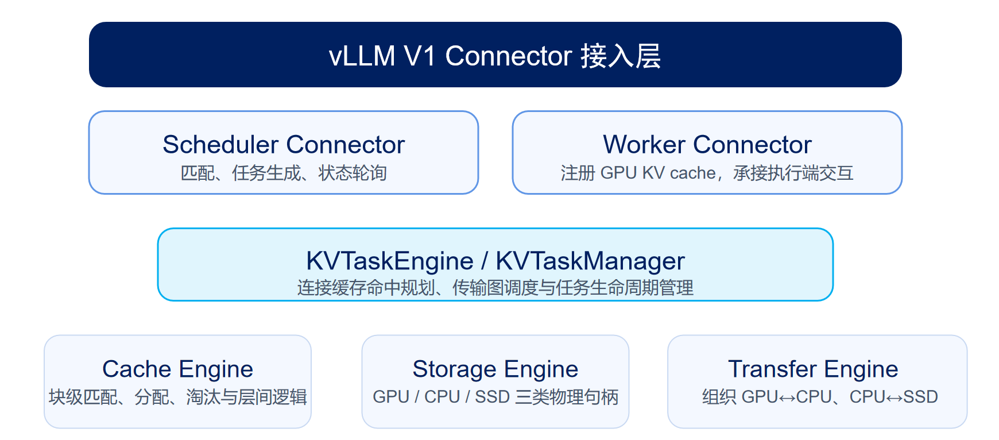
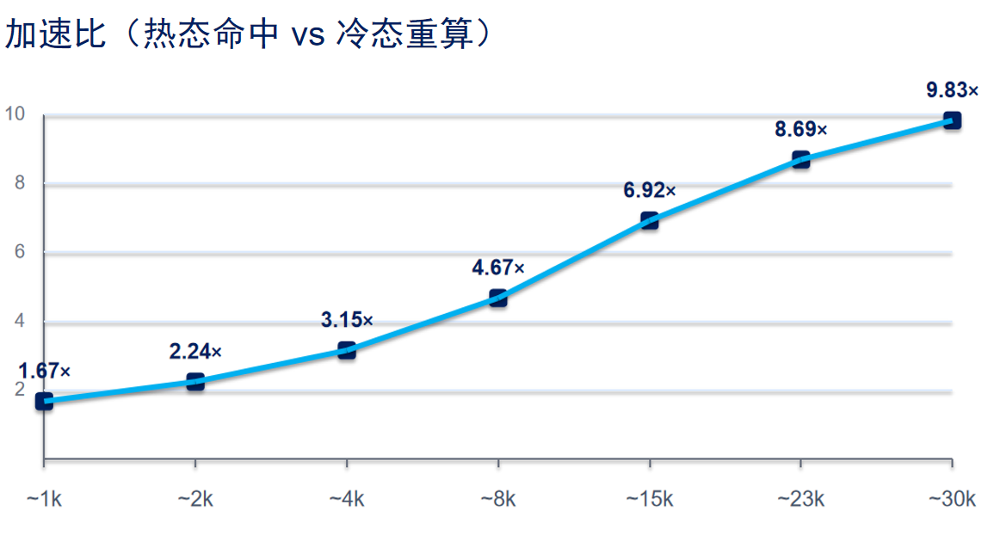
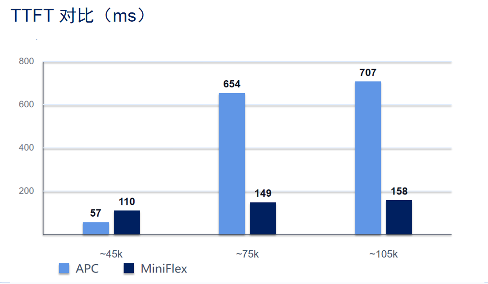
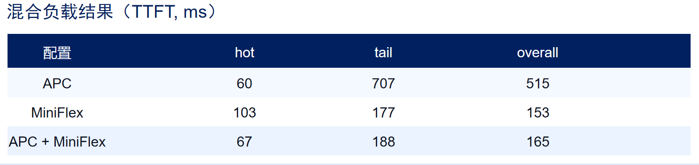
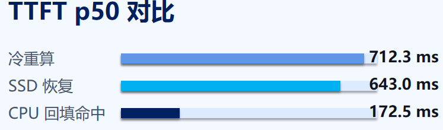

# MiniFlex 设计开发文档

## 目录

- [一、基本信息](#一基本信息)
- [二、目标描述](#二目标描述)
- [三、比赛题目分析和相关资料调研](#三比赛题目分析和相关资料调研)
- [四、系统框架设计](#四系统框架设计)
- [五、开发计划](#五开发计划)
- [六、比赛过程中的重要进展](#六比赛过程中的重要进展)
- [七、系统测试情况](#七系统测试情况)
- [八、遇到的主要问题和解决方法](#八遇到的主要问题和解决方法)
- [九、分工和协作](#九分工和协作)
- [十、提交仓库目录和文件描述](#十提交仓库目录和文件描述)
- [十一、比赛收获](#十一比赛收获)
- [十二、非本队来源说明与合规披露](#十二非本队来源说明与合规披露)

## 一、基本信息

| 项目 | 内容 |
| --- | --- |
| 赛题 | proj21——面向AI推理负载的异构存储管理系统优化 |
| 比赛名称 | 2026全国大学生计算机系统能力大赛操作系统设计赛全国总决赛（功能挑战赛道） |
| 比赛成绩 | 国家二等奖 |
| 参赛队伍 | 古法编程继承人 |
| 团队成员 | 井光成、徐子淳、祁馨叶 |
| 参赛学校 | 西安邮电大学 |

本项目最终参加 **2026全国大学生计算机系统能力大赛操作系统设计赛全国总决赛功能挑战赛道**，围绕赛题完成 GPU / CPU / SSD 三级 KV Cache 管理系统的设计、实现和验证，获得 **国家二等奖**。获奖名单佐证见 [`image/比赛获奖照片.png`](./image/比赛获奖照片.png)。

## 二、目标描述

### 2.1 背景与意义

在现代大语言模型推理场景中，KV Cache 是支撑自注意力高效计算的关键结构。随着上下文长度增加，尤其是在长文问答、Agent、复杂工作流与多轮对话场景中，KV Cache 的显存占用迅速增长，并逐渐成为 GPU 显存资源的主要消耗来源。

这一问题在实际系统中会带来以下直接影响：

1. **长上下文成本快速上升**：prefill 阶段生成的大量 KV 会显著占用显存；
2. **容量一旦越界就容易退化**：当工作集超过 GPU 容量后，系统往往出现高 miss、重算和明显时延抖动；
3. **资源利用不均衡**：GPU 显存紧张，但 CPU 内存与 SSD 容量相对充足，现有路径对其利用不足；
4. **工程改造成本高**：若直接深度改写现有推理框架主路径，系统维护、适配与复现成本都很高。

因此，本项目的意义在于构造一套**面向真实推理负载、兼顾工程接入与性能收益**的 KV Cache 分层管理机制，使系统在资源受限条件下仍具备较好的上下文支撑能力与性能稳定性。

### 2.2 项目总体概述

MiniFlex 是一个基于 vLLM V1 KV connector 的分层缓存系统。项目通过相对低侵入的方式接入推理框架，将 KV Cache 视为可管理、可迁移、可回填的 block 级资源，并围绕其生命周期构建逻辑缓存、物理存储、跨层传输和任务编排机制。

当前项目的总体目标是：

- 在尽量少改动推理框架主流程的前提下实现 KV Cache 分层管理；
- 在长上下文场景下降低 prefill 重算开销；
- 在超显存工作集场景下获得更稳定的命中与时延表现；
- 形成可复现、可展示、可持续迭代的比赛作品基础。

### 2.3 目标描述

结合赛题方向和当前工程状态，本项目将目标划分为以下几项：

| 目标方向 | 目标说明 |
| --- | --- |
| 目标一 | 设计并实现 KV Cache 的 block 级分层管理机制 |
| 目标二 | 建立 GPU / CPU / SSD 三层缓存组织与迁移路径 |
| 目标三 | 通过透明接入方式接管 vLLM 中的 KV 生命周期 |
| 目标四 | 面向长上下文场景减少 prefill 重算 |
| 目标五 | 面向超容量场景提高系统稳定性与工作集承载能力 |
| 目标六 | 完成结构说明、使用说明、验证材料和演示脚本整理 |

## 三、比赛题目分析和相关资料调研

### 3.1 赛题理解与调研结论

本赛题围绕大语言模型推理过程中的 KV Cache 管理与优化展开。随着上下文长度增加，prefill 阶段生成的 KV Cache 会持续占用 GPU 显存；当请求上下文较长、并发较高或缓存工作集超过显存容量时，系统容易出现重复计算增加、首 token 时延上升、缓存命中不稳定以及整体时延抖动等问题。

结合赛题方向，我们将题目要求理解为以下几个方面：

1. 提升 KV Cache 复用能力，减少重复 prefill 计算；
2. 扩展缓存承载容量，不能只依赖 GPU 显存；
3. 在长上下文和超容量场景下保持较稳定的推理性能；
4. 尽量兼容现有推理框架，降低工程接入成本；
5. 通过测试脚本和实验结果验证方案正确性与实际效果。

因此，本项目的重点不是单纯实现一个缓存容器，而是围绕 KV Cache 的生成、命中、迁移、回填、淘汰和跨层存储，设计一套面向 LLM 推理负载的分层缓存管理系统。

根据我们在 `归档-日志-调研-测试/docs/Implementation_Investigation/KV_Cache工作机制详解.md` 和 `归档-日志-调研-测试/docs/Implementation_Investigation/KvCache_token复用机制详解.md` 中的调研，KV Cache 的问题主要体现在以下方面：

1. **容量随上下文增长快速上升**：上下文越长，KV Cache 占用越大，容易成为显存瓶颈；
2. **prefill 阶段重复计算成本高**：如果相同或相似前缀不能复用，系统需要重复执行 prefill；
3. **单层 GPU 缓存容量有限**：GPU 显存速度快但容量有限，超过容量后容易发生淘汰和时延波动；
4. **CPU 与 SSD 资源具备扩展潜力**：CPU 内存和 SSD 容量更大，但访问速度低于 GPU；
5. **缓存管理需要与推理调度协同**：KV Cache 与请求调度、block 分配、前缀匹配、张量布局和跨层传输密切相关。

我们重点调研了 vLLM 的 PagedAttention、block 管理、前缀缓存、CPU offload 以及 KV connector 相关机制，相关材料整理在 `归档-日志-调研-测试/` 文件夹 中。调研后我们确认：vLLM 通过 block 粒度管理 KV Cache，为外部缓存系统按 block 级别接入提供了基础；前缀缓存可以减少重复 prefill，但在超容量场景下仍受 GPU 显存限制；vLLM V1 KV connector 则提供了相对低侵入的外部缓存接入路径。

我们还对 FlexKV、LMCache、Mooncake 和 APC 等相关方案进行了对比调研，调研结论如下：

1. **FlexKV** 更强调前缀匹配驱动的缓存复用，以及 GPU、CPU、外部存储之间的分层缓存管理；
2. **LMCache** 侧重 KV 对象缓存中间层、异步预取和多后端存储，适合作为相关方案与设计边界的参考；
3. **Mooncake** 更偏向高性能传输、对象存储和 KVCache-centric 架构，有助于理解底层资源管理思路；
4. **APC** 可作为前缀缓存复用方向的重要 baseline，用于对比长上下文和超容量场景下的表现。

最终，我们选择的技术路线是：以 vLLM V1 KV connector 作为接入点，参考 FlexKV 的前缀匹配和分层缓存思路，结合项目实际自主实现 MiniFlex 的缓存管理、物理存储、跨层传输和调度执行模块。LMCache 与 Mooncake 主要作为相关方案调研和设计边界对比，不作为当前系统的直接实现基础。

### 3.2 问题拆解

围绕赛题本身，项目需要解决的不是单一问题，而是一组关联问题：

#### 3.2.1 容量问题

当上下文增长时，KV Cache 容量线性上升，显存成为首要瓶颈。如果没有分层管理机制，系统只能依靠缩短上下文、提高显存预算或在 miss 后重算。

#### 3.2.2 时延问题

即使引入外部缓存，如果数据回填与调度路径设计不合理，系统可能只是把“重算等待”替换为“搬运等待”。因此，项目不仅要考虑“放哪里”，还要考虑“何时取、如何取、由谁调度”。

#### 3.2.3 工程问题

如果系统需要深度改动推理框架主干逻辑，即使在实验中可行，也很难在比赛要求下保持清晰可复现。因此项目必须在“优化空间”和“工程复杂度”之间做平衡。

### 3.3 方案选型

#### 3.3.1 基于 connector 的透明接入 + 外部缓存分层管理

该方案的核心优势在于：

1. 对主框架侵入较低；
2. 易于形成清晰的模块边界；
3. 便于单独验证缓存管理、传输与回填路径；
4. 更适合比赛阶段的结构化展示。

## 四、系统框架设计

### 4.1 整体架构设计

MiniFlex 当前整体上采用“接入层—任务层—缓存层—存储层—传输层”的分层组织方式。

```text
vLLM
└─ MiniFlexConnectorV1
   ├─ Scheduler 侧任务入口
   │  └─ KVTaskEngine / KVTaskManager
   │     ├─ GlobalCacheEngine
   │     ├─ CPU CacheEngine
   │     ├─ SSD CacheEngine
   │     └─ TransferManagerHandle
   └─ Worker 侧注册入口
      └─ GPU storage handle 注册

TransferManager
├─ StorageEngine
└─ TransferEngine
   ├─ GPU ↔ CPU worker
   ├─ CPU ↔ SSD worker
   └─ SSD ↔ GPU GDS worker（原型实现，未接入主线）
```

为了更直观地说明该分层结构与模块关系，可对应参考下图：



*图 4-1 MiniFlex 整体架构示意图*

该图展示了 `vLLM V1 Connector` 接入层、`KVTaskEngine / KVTaskManager` 任务组织层，以及 `Cache Engine`、`Storage Engine`、`Transfer Engine` 三个核心执行模块之间的关系。

这一结构的核心思想是：

- **接入层**只处理与 vLLM 生命周期的对接；
- **任务层**负责把 KV 的 GET / PUT / 回填组织为可调度流程；
- **缓存层**负责命中判断、前缀匹配、block 管理和状态维护；
- **存储层**负责真正保存数据及其句柄；
- **传输层**负责不同存储介质之间的数据搬运。

这一结构已经落实为若干明确的核心类：

| 层次 | 关键类 / 文件 | 主要职责 |
| --- | --- | --- |
| 接入层 | `MiniFlexConnectorV1Impl`、`MiniFlexSchedulerConnector`、`MiniFlexWorkerConnector` | 对接 vLLM 的 scheduler / worker 生命周期 |
| 任务层 | `KVTask`、`KVTaskManager`、`KVTaskEngine` | 组织 GET / PUT 任务与状态推进 |
| 缓存层 | `GlobalCacheEngine`、`CacheEngine`、`RadixTree`、`Mempool` | 命中匹配、block 分配、ready/pending 管理 |
| 存储层 | `StorageEngine` | GPU / CPU / SSD 的存储句柄管理 |
| 传输层 | `TransferManager`、`TransferEngine`、`GPUCPUTransferWorker`、`SSDCPUTransferWorker`、`GDSTransferWorker` | 管理和执行跨层传输任务，其中 GDS worker 目前为原型实现，尚未接入主线逻辑 |

也正因为各层职责明确，项目才能在后期继续增加 SSD 层、传输后端和布局适配，而不必推翻整体结构。

#### 4.1.1 Scheduler 侧运行路径

Scheduler 侧主要完成以下工作：

1. 接收请求并分析当前请求可复用的 KV 前缀；
2. 将请求转换为 GET 或 PUT 类型的 KV 任务；
3. 通过 `KVTaskEngine` 将任务交给缓存层和传输层处理；
4. 在每一轮调度结束时，通过 `build_connector_meta` 生成本步需要传给 Worker 的元数据；
5. 通过 `query_finished_tasks` 回收已经完成的任务状态，并更新后续调度决策。

MiniFlex 不是在请求执行完以后“顺手做一个缓存”，而是在 scheduler 的每一步中显式参与 KV 生命周期管理。

#### 4.1.2 Worker 侧运行路径
Worker 侧主要负责：

1. 在启动阶段把 GPU 侧 KV 存储句柄注册给 MiniFlex；
2. 接收 Scheduler 传来的 connector metadata；
3. 在 forward 前后配合完成 KV 的接收、保存或回填；
4. 将执行结果反馈回 Scheduler 所在路径。

这种设计使 MiniFlex 可以在不重写 Worker 主逻辑的前提下，把 GPU 上真实可用的 KV 空间纳入统一管理。

### 4.2 vLLM 接入设计

项目当前通过 `MiniFlexConnectorV1` 接入 vLLM。这样做的原因有三点：

1. 可以避免重写大部分推理主流程；
2. 使缓存管理功能以插件形式存在，结构更清晰；
3. 更有利于比赛中说明“本项目优化的是操作系统 / 运行时侧的缓存管理能力，而不是重新实现整个推理框架”。

在该设计下：

- Scheduler 侧负责组织请求相关的 KV 任务；
- Worker 侧负责把 GPU 上的 KV 存储句柄注册给传输管理模块；
- MiniFlex 在不改变主要推理语义的前提下参与 KV 生命周期管理。

### 4.3 逻辑缓存设计

逻辑缓存层的核心在于回答以下问题：

1. 哪些 KV block 已存在；
2. 哪些前缀能够命中；
3. 哪些 block 已 ready，哪些仍 pending；
4. 当空间不足时如何分配和回收。

当前实现中，逻辑缓存层主要由以下模块支撑：

- `RadixTree`：用于前缀组织和命中匹配；
- `Mempool`：用于 block id 的分配与回收；
- `CacheEngine`：用于单层缓存状态管理；
- `GlobalCacheEngine`：用于统一协调 CPU / SSD 两层缓存视图。

这种设计使系统能够先在逻辑层决定“命中与否、需要哪些块、走哪条路径”，再把物理执行交给下游模块。

进一步结合代码实现，逻辑缓存层实际上承担了“规划器”的角色：

- `CacheEngine.match()` 负责判断一个序列前缀在当前层是否已存在；
- `GlobalCacheEngine.get()` 负责从多层缓存视角决定一次 GET 应如何命中；
- `GlobalCacheEngine.put()` 负责把新产生的 KV block 纳入缓存体系；
- `RadixTree` 提供前缀匹配基础，使项目不只是按请求 id，而是按前缀结构进行复用；
- `Mempool` 负责 block id 资源池，保证 block 级分配和回收可以持续进行。


### 4.4 物理存储设计

物理存储层负责真正持有数据。与逻辑缓存层不同，它关注的是：

- 数据存放在哪个层级；
- 每层对应的存储句柄是什么；
- 如何完成不同层级上的块空间管理。

在当前实现中：

- GPU 层提供当前推理执行所需的高性能访问空间；
- CPU 层作为主要的外部缓存层，承担命中后的快速回填；
- SSD 层作为容量扩展层，进一步扩展可承载工作集规模。

### 4.5 传输与调度设计

项目的关键不只是有外部缓存，还在于怎样把外部缓存中的数据高效搬回来。

因此，MiniFlex 在传输路径上进行了明确拆分：

#### 4.5.1 GPU ↔ CPU

该路径需要较高吞吐和较低开销，因此项目提供了 C++ / CUDA 扩展来实现 GPU 与 CPU 之间的块传输。

#### 4.5.2 CPU ↔ SSD

该路径侧重容量支撑和 I/O 效率，因此引入 `io_uring` 后端作为 SSD 读写实现基础。

#### 4.5.3 可选 GDS 直连后端原型

在 SSD 命中场景下，当前主线需要先将数据从 SSD 读入 CPU，再由 CPU 回填到 GPU，即 `DISK2H → H2D`。决赛阶段进一步补充了可选的 GDS 后端原型，包括 `DISK2D` / `D2DISK` 传输类型、`GDSIOCTX` 与 `GDSTransferWorker`，用于探索后续在支持 cuFile 的环境中接入 SSD ↔ GPU 直连路径的可能性。

这一部分目前只是原型实现和后续方向，尚未接入 MiniFlex 的主线 GET / PUT 规划逻辑。当前端到端 SSD 测试验证的是 `GPU → CPU → SSD` 持久化、`SSD → CPU → GPU` 恢复，以及恢复后 CPU 回填命中的完整闭环。后续若将 GDS 接入主线，还需要进一步处理 SSD 直达 GPU 后是否晋升 CPU、何时晋升 CPU，以及如何避免无效 CPU block 申请带来的 mempool 压力。

#### 4.5.4 任务化调度

项目并未把传输实现为发现 miss 就立刻同步拷贝，是将 GET、PUT、回填和提交组织为任务流程，使逻辑规划与底层执行解耦。这样既便于扩展，也便于后续分析系统行为。

从当前代码结构看，这条链路的核心关系大致如下：

1. Scheduler 侧根据请求创建 `MiniFlexGetTask` 或 `MiniFlexPutTask`；
2. `KVTaskManager` 将请求转换为 `KVTask`，并维护任务状态；
3. `GlobalCacheEngine` 先判断命中情况和需要的 block；
4. 若需要跨层搬运，则由 `TransferManager` / `TransferEngine` 组织传输图；
5. 当前主线搬运由 `GPUCPUTransferWorker` 与 `SSDCPUTransferWorker` 执行，`GDSTransferWorker` 仅作为后续直连路径的原型 worker，尚未进入主线逻辑；
6. 任务完成后，结果再反馈回 Scheduler，用于更新下一轮状态。

这种组织方式使项目天然具备进一步扩展的空间。例如，未来若要补充更复杂的迁移策略、预取策略或新的存储层，主要改动可以集中在任务层和缓存层，而不需要彻底重写底层接口。针对异步任务可能先返回 task-end response、底层 transfer graph 后续才完成的情况，任务层还维护了 response 是否已返回的状态，用于在 graph 完成后自动释放任务记录和中间资源。

#### 4.5.5 GET / PUT 两条主链路说明

为了更贴近真实工程实现，可以把 MiniFlex 的运行过程归纳为两条主链路：

##### GET 链路

GET 链路对应“已有 KV 是否可以复用”的问题。其主要流程是：

1. 请求到来后，Scheduler 侧根据前缀构造 GET 任务；
2. `GlobalCacheEngine` 判断命中层级与已匹配 block；
3. 若命中内容位于 CPU / SSD 层，则构造相应传输任务；
4. 由传输层将所需 block 回填到 GPU 可用区域；
5. Worker 在后续计算中直接使用已回填的 KV，减少 prefill 重算。

##### PUT 链路

PUT 链路对应“新产生的 KV 如何持久进入多层缓存”的问题。其主要流程是：

1. 请求在当前轮完成后，系统判断其 KV 是否值得保存；
2. Scheduler 构造 PUT 任务并交给任务层；
3. `GlobalCacheEngine.put()` 负责在逻辑层登记 block；
4. 传输层将相应 block 从 GPU 搬运到 CPU，必要时进一步写入 SSD；
5. 缓存状态更新为 ready，供后续请求复用。

从设计上看，GET 与 PUT 并不是互相独立的两个附加功能，而是围绕同一套 block 管理、存储句柄和传输任务体系协同运行的。

### 4.6 兼容适配与工程细节

MiniFlex 在当前阶段额外处理了：

1. vLLM 接口变化带来的适配问题；
2. KV layout 差异带来的 block 重排问题；
3. 当前 GPU 平台与扩展构建链路中的兼容问题；
4. demo、bench、usage 等材料的工程化整理问题。


### 4.7 代码说明模块

为了让设计文档不仅说明“做了什么”，也能回答“代码里是怎么落下来的”，本节结合 `miniflex/docs`、当前仓库结构以及核心源码，对主要模块、关键类和主调用关系进行补充说明。

整体上，MiniFlex 的代码可以概括为一条清晰的分层链路：

1. `integration/vllm/` 负责接入 vLLM 生命周期；
2. `kvtask.py` 负责把 GET / PUT 请求组织成可调度任务；
3. `cache/` 负责逻辑缓存判断、block 分配与命中管理；
4. `storage/` 负责 CPU / SSD / GPU 对应的物理存储句柄；
5. `transfer/` 与 `transfer_manager.py` 负责跨层搬运执行；
6. `csrc/` 负责 GPU↔CPU、CPU↔SSD 的底层高性能实现，并包含可选 SSD↔GPU GDS 直连后端的原型代码。

这套实现的一个核心特点是：**逻辑决策与物理搬运分离**。也就是说，判断哪些 KV 值得复用、哪些 block 应该放在哪一层，由缓存和任务层决定；真正的数据拷贝，则交给传输层和底层扩展完成。这样做可以减少模块耦合，也使后续替换某一层实现时不必重写整条链路。

#### 4.7.1 vLLM 接入层代码说明

接入层对应代码主要位于：

- `pysrc/miniflex/integration/vllm/connector.py`
- `pysrc/miniflex/integration/vllm/vllm_v1_adapter.py`

其中，`MiniFlexConnectorV1` 是唯一直接继承 `KVConnectorBase_V1` 的类，本身几乎不承载业务逻辑，只负责满足 vLLM 的构造约定，并把接口调用转发给 `MiniFlexConnectorV1Impl`。`MiniFlexConnectorV1Impl` 再根据当前角色是 `SCHEDULER` 还是 `WORKER`，分别持有 `MiniFlexSchedulerConnector` 或 `MiniFlexWorkerConnector`。

这种写法的好处在于：

1. 入口层保持薄壳化，vLLM 版本变动时修改面更小；
2. Scheduler 逻辑和 Worker 逻辑被明确拆开，方便单独调试和排障。

Scheduler 侧最关键的接口包括：

- `get_num_new_matched_tokens()`：在调度阶段根据请求前缀判断是否命中已有外部 KV；
- `update_state_after_alloc()`：在 vLLM 完成 GPU block 分配后，把真正要回填到哪些 block 的信息补充到 GET 任务里；
- `build_connector_meta()`：在一次调度输出形成后，处理任务发射、取消、抢占后的状态收敛；
- `request_finished()`：请求结束时判断是否需要把新生成的 KV 作为 PUT 任务写入外部缓存。

Worker 侧则更偏执行面，主要负责：

- `register_kv_caches()`：把 vLLM 当前 GPU KV cache 的底层 tensor 注册给 MiniFlex；
- `start_load_kv()` / `wait_for_layer_load()`：为回填流程提供加载时机接口；
- `save_kv_layer()` / `wait_for_save()`：在需要保存新 KV 时，按层触发写出流程；
- 通过 `MiniFlexGPURegisterClient` 把 GPU 端布局与共享句柄发给 `TransferManager`。


**Scheduler 侧 GET 命中判断伪代码如下：**

```python
def get_num_new_matched_tokens(request, num_computed_tokens):
    task_id, num_new_matched_tokens = _get_match(request, num_computed_tokens)

    if num_new_matched_tokens <= 0:
        cancel_task(task_id)
        return 0, False

    req_id_to_task[request.request_id] = task_id
    tasks_to_cancel[task_id] = MiniFlexGetTask(
        task_id=task_id,
        request=request,
        num_computed_tokens=num_computed_tokens,
        num_new_matched_tokens=num_new_matched_tokens,
    )
    return num_new_matched_tokens, True
```

这段流程对应的真实含义是：先只做“命中判断”，不立即发射搬运；等 vLLM 完成 GPU block 分配后，再由 `update_state_after_alloc()` 把目标 block id 补齐，随后正式启动 GET 任务。

**请求结束后触发 PUT 的伪代码如下：**

```python
def request_finished(request, block_ids):
    if request.request_id in req_id_to_task:
        return True

    if not request.is_finished():
        return False

    task_id, matched_tokens, unmatched_tokens = _put_match(request)
    if unmatched_tokens <= 0:
        return False

    task = tasks_to_cancel.pop(task_id)
    task.block_ids = select_unmatched_blocks(block_ids, matched_tokens, unmatched_tokens)
    task.slot_mapping = build_slot_mapping(task.block_ids)
    tasks_to_launch[task_id] = task
    return True
```

这个阶段的设计重点在于：并不是所有请求结束后都要写入缓存，而是只把“当前外部缓存里还不存在的那部分 block”组织成 PUT 任务，避免重复写入。

#### 4.7.2 任务层代码说明

任务层位于 `pysrc/miniflex/kvtask.py`，是连接“调度请求”和“缓存 / 传输执行”的中间层。其存在意义在于：不要把一次命中回填或一次保存写出，写成零散的同步函数调用；而是把它们抽象为状态明确、可取消、可回收的任务对象。

该文件中的核心对象包括：

- `KVTask`：单个任务的数据载体，记录任务类型、状态、block 信息和回调；
- `KVTaskManager`：负责任务创建、任务编号管理、任务与传输图的绑定；
- `KVTaskEngine`：面向上层暴露统一接口，驱动任务提交、取消、轮询与完成处理。

在实际代码路径中，GET 请求一般先由 `create_get_task()` 建立任务，PUT 请求一般由 `create_put_task()` 建立任务；`KVTaskManager` 再调用 `GlobalCacheEngine.get()` 或 `GlobalCacheEngine.put()`，把逻辑命中结果转换成需要执行的传输图，随后交给 `TransferManager` 执行。

任务层承担了三项作用：

1. 统一 GET / PUT 的生命周期；
2. 把缓存规划结果转成传输可执行对象；
3. 为取消、抢占、批量合并和回调收尾预留统一管理点。

**任务层的统一调度逻辑可以抽象为：**

```python
def submit_kv_request(kv_request):
    task_id = alloc_task_id()

    if kv_request.type == GET:
        graph, return_mask, callback = global_cache_engine.get(...)
    else:
        graph, return_mask, callback = global_cache_engine.put(...)

    task_manager.bind(task_id, graph, callback)
    transfer_manager.submit(graph)
    return task_id, return_mask
```

这段伪代码把上层的“GET / PUT 意图”翻译成下层可执行的 `TransferOpGraph`，其本身并不直接关心 memcpy 细节，而是关心任务编号、状态绑定和回调时机。

#### 4.7.3 逻辑缓存层代码说明

逻辑缓存层主要位于：

- `pysrc/miniflex/cache/cache_engine.py`
- `pysrc/miniflex/cache/global_cache_engine.py`
- `pysrc/miniflex/cache/radix_tree.py`
- `pysrc/miniflex/cache/mempool.py`

这一层不直接保存 tensor 数据，而是管理“哪些前缀已经存在、存在于哪个物理 block、当前是否 ready、是否允许淘汰”。

其中，`CacheEngine` 表示单一层级缓存的逻辑视图。它内部维护两类关键结构：

- `RadixTree`：按 token 前缀组织缓存条目，支持前缀匹配；
- `Mempool`：维护该层剩余物理 block id，可分配、可回收。

从函数职责上看：

- `match()` 负责查找一个序列在当前层最多能命中多少 block；
- `take()` 负责为即将写入的新 KV 申请物理 block，必要时会触发淘汰；
- `insert()` 负责把逻辑条目写入前缀树；
- `set_ready()` 负责标记一次写入是否已经变为可复用状态；
- `pin()` / `unpin()` 用于在关键阶段保护节点，避免回填或写入期间被错误淘汰。

`GlobalCacheEngine` 则是在单层 `CacheEngine` 之上统一调度 CPU 和 SSD 两层逻辑缓存，并向任务层暴露更高层的 `get()` / `put()` 接口。它会先调用 `match_all()` 比较两层命中情况，再根据命中层级、缺失 block 数量和目标布局，拼装出对应的 `TransferOpGraph` 返回给任务层。

**单层缓存命中与分配逻辑伪代码如下：**

```python
def cache_take(num_required_blocks, protected_node=None):
    utilization = mempool.num_used_blocks / num_total_blocks
    should_evict = (
        utilization >= evict_start_threshold
        or mempool.num_free_blocks < num_required_blocks
    )

    if should_evict:
        if protected_node is not None:
            pin(protected_node)
        evicted_blocks = radix_tree.evict(required_blocks=num_required_blocks)
        mempool.recycle(evicted_blocks)
        if protected_node is not None:
            unpin(protected_node)

    return mempool.allocate(num_required_blocks)
```

这里体现了 `CacheEngine.take()` 的关键思想：**先判断空间是否足够，不够则先淘汰，再分配 block**。同时，为了避免正在参与命中 / 回填的节点被误删，系统允许用 `pin()` / `unpin()` 对关键节点做临时保护。

**多层 GET 规划逻辑可概括为：**

```python
def global_get(sequence, gpu_blocks):
    cpu_match = cpu_cache_engine.match(sequence)
    ssd_match = ssd_cache_engine.match(sequence)

    if cpu_match.hit_blocks >= ssd_match.hit_blocks:
        graph = build_h2d_graph(cpu_match.blocks, gpu_blocks)
        return graph, cpu_match.return_mask

    graph = build_disk2h_graph(ssd_match.blocks)
    graph.append(build_h2d_graph(temp_cpu_blocks, gpu_blocks))
    return graph, ssd_match.return_mask
```

这段流程对应 `GlobalCacheEngine.get()` 当前主线的核心决策：优先选择命中更长、代价更低的层级；若命中来自 SSD，则经过 `DISK2H -> H2D` 两段搬运完成恢复。GDS 相关的 `DISK2D` / `D2DISK` 类型和 worker 目前只是原型实现，尚未作为当前主线 GET 规划路径。

#### 4.7.4 数据结构与布局代码说明

这部分关键代码位于：

- `pysrc/miniflex/common/storage.py`
- `pysrc/miniflex/common/block.py`
- `pysrc/miniflex/common/hash.py`

 `KVCacheLayout`这个类**把抽象的 KV block 概念变成可计算的形状、步长和字节大小描述**。当前代码里，CPU、SSD、GPU 三层虽然都表示“KV block”，但具体 layout 可能不同，`KVCacheLayout` 是统一描述它们的基础。

在设计意义上，它主要解决以下问题：

1. 一个 block 在当前布局下的 shape 是什么；
2. 每个 token 对应多少元素 / 字节；
3. 整个 block 的总大小是多少；
4. 某层布局与另一层布局是否兼容，是否需要重排。

此外，`StorageHandle` 负责把布局定义与实际物理承载对象绑定起来；`SequenceMeta` 负责把 token 序列切成 block 粒度并生成匹配所需元信息；`hash_token()` 和 namespace 相关逻辑则负责把相同 token 但不同业务上下文的请求隔离开来，避免误命中。

#### 4.7.5 存储层代码说明

物理存储层主要位于：

- `pysrc/miniflex/storage/storage_engine.py`
- `pysrc/miniflex/storage/allocator.py`

`StorageEngine` 统一管理不同设备层级对应的 `StorageHandle`。在初始化时，它会根据配置决定是否创建 CPU 层 handle、SSD 层 handle，以及等待 Worker 注册后的 GPU 层 handle。

`allocator.py` 中则把不同层的实际分配方式拆开：

- `GPUStorageAllocator` 负责从 vLLM 已有 GPU tensor 或共享句柄中构造可访问的 GPU handle；
- `CPUStorageAllocator` 负责申请 pinned memory 作为 CPU 缓存承载区；
- `SSDStorageAllocator` 负责创建 SSD 文件后端，并按 block 组织文件内偏移。

这样拆分后，不同设备的分配约束、来源和生命周期都能分别处理，后续若要新增层级，扩展 allocator 也比改动上层缓存逻辑更自然。

#### 4.7.6 传输层与调度执行代码说明

传输执行相关代码主要位于：

- `pysrc/miniflex/common/transfer.py`
- `pysrc/miniflex/transfer/transfer_engine.py`
- `pysrc/miniflex/transfer/scheduler.py`
- `pysrc/miniflex/transfer/worker.py`
- `pysrc/miniflex/transfer_manager.py`

其中，`common/transfer.py` 定义了整套传输描述协议，包括 `TransferType`、`TransferOp` 和 `TransferOpGraph`。 MiniFlex 的传输不是按单个 memcpy 调用组织的，而是按有先后依赖的操作图组织。

例如：

- 当数据只在 CPU 命中时，可以直接组织 `H2D`；
- 当数据只在 SSD 命中时，需要先 `DISK2H`，再 `H2D`；
- 当一次 PUT 需要多层写出时，则可能先 `D2H`，再 `H2DISK`。

`TransferScheduler` 根据已经完成的操作，找出当前图中哪些后继 op 变成 ready。`TransferEngine` 则负责接收 `TransferOpGraph`、分发 ready op、接收 worker 完成回报，并持续推进图执行。`TransferManager` 再把 `StorageEngine` 与 `TransferEngine` 组合起来，对外提供统一句柄，屏蔽底层执行细节。

MiniFlex **把跨层数据搬运建模为图执行问题，而不是写成若干彼此耦合的同步过程**。

**传输图构建与执行伪代码如下：**

```python
def build_get_graph(hit_level, src_blocks, dst_gpu_blocks):
    graph = TransferOpGraph()

    if hit_level == CPU:
        h2d = TransferOp(H2D, src_block_ids=src_blocks, dst_block_ids=dst_gpu_blocks)
        graph.add_transfer_op(h2d)
        return graph

    disk2h = TransferOp(DISK2H, src_block_ids=src_blocks, dst_block_ids=temp_cpu_blocks)
    h2d = TransferOp(H2D, src_block_ids=temp_cpu_blocks, dst_block_ids=dst_gpu_blocks)
    graph.add_transfer_op(disk2h)
    graph.add_transfer_op(h2d)
    graph.add_dependency(h2d.op_id, disk2h.op_id)
    return graph
```

```python
def step_transfer_engine():
    finished_ops = collect_finished_ops_from_workers()
    ready_graph_ids, new_ready_ops = scheduler.schedule(finished_ops)

    for op in new_ready_ops:
        worker = select_worker(op.transfer_type)
        worker.submit_transfer(op)
```

MiniFlex **用依赖图保证执行顺序**。例如 `DISK2H -> H2D` 这种链路中，只有前一个 op 完成后，后一个 op 才会变成 ready。

#### 4.7.7 Worker 与底层扩展代码说明

真正的数据搬运最终由 worker 和 C++ / CUDA 扩展完成，相关代码主要位于：

- `pysrc/miniflex/transfer/worker.py`
- `csrc/bindings.cpp`
- `csrc/transfer.cu`
- `csrc/ssd_io_uring.cpp`
- `csrc/gds_io.cpp`

在 Python 层，`worker.py` 定义了三类核心 worker：

- `GPUCPUTransferWorker`：负责 GPU 与 CPU 之间的双向块传输；
- `SSDCPUTransferWorker`：负责 SSD 与 CPU 之间的读写；
- `GDSTransferWorker`：作为 GDS 直连方案的 worker 端原型，用于探索后续接入 SSD 与 GPU 之间直接读写的可能性。

底层扩展部分中，`bindings.cpp` 负责通过 pybind11 暴露底层能力，`transfer.cu` 负责 GPU↔CPU 的 stride 化 block 拷贝，`ssd_io_uring.cpp` 负责 SSD 文件后端的 `io_uring` 读写，`gds_io.cpp` 包含基于 cuFile 的 `DISK2D` / `D2DISK` 直连搬运原型代码。当前 Python 主线调度与端到端验证仍只使用 GPU↔CPU、CPU↔SSD 两段路径。

**Worker 侧执行逻辑可抽象为：**

```python
def gpu_cpu_worker_loop(op):
    if op.transfer_type == H2D:
        cuda_copy(cpu_handle, gpu_handle, op.src_block_ids, op.dst_block_ids)
    elif op.transfer_type == D2H:
        cuda_copy(gpu_handle, cpu_handle, op.src_block_ids, op.dst_block_ids)
    mark_completed(op)
```

```c
// transfer.cu 的核心思想可以抽象为
for each block_id in transfer_blocks:
    for each layer in num_layers:
        compute_src_offset(block_id, layer)
        compute_dst_offset(block_id, layer)
        launch_or_copy_strided_region(src_ptr, dst_ptr, bytes)
```

```c
// ssd_io_uring.cpp 的核心流程可以抽象为
for each ssd_block in transfer_blocks:
    sqe = io_uring_get_sqe(&ring)
    io_uring_prep_readv_or_writev(sqe, fd, iov, iovcnt, offset)

io_uring_submit(&ring)

for each submitted_request:
    cqe = wait_cqe(&ring)
    check_result(cqe)
```

```c
// gds_io.cpp 的核心流程可以抽象为
for each kv_block in transfer_blocks:
    file_offset = compute_ssd_offset(kv_block)
    gpu_offset = compute_gpu_offset(kv_block, layer)
    cuFileRead_or_Write(file_handle, gpu_ptr + gpu_offset, bytes, file_offset)
```

GPU↔CPU 路径本质上是**按 block、按 layer、按 layout 做分段拷贝**；CPU↔SSD 路径本质上是**按 block 组织批量异步 I/O 请求并收割完成事件**；GDS 后端目前只是直连方向的原型实现，尚未替代当前 SSD → CPU → GPU 主线。

#### 4.7.8 代码主链路总结

结合上述模块，可以把当前代码中的两条核心路径再次落到源码：

**GET 主链路：**

1. vLLM 调用 `MiniFlexConnectorV1.get_num_new_matched_tokens()`；
2. 调度逻辑进入 `MiniFlexSchedulerConnector`，创建 GET 任务；
3. `KVTaskEngine` 调用 `GlobalCacheEngine.get()` 判断 CPU / SSD 命中并生成传输图；
4. `TransferManager` 把传输图交给 `TransferEngine`；
5. `TransferEngine` 调度 `SSDCPUTransferWorker` 和 `GPUCPUTransferWorker` 执行当前主线搬运；
6. 搬运完成后，结果回传到任务层，后续计算直接复用已回填的 GPU KV。

**PUT 主链路：**

1. 请求结束后，vLLM 调用 `request_finished()`；
2. Scheduler 判断哪些 block 仍未被外部缓存覆盖，并创建 PUT 任务；
3. `GlobalCacheEngine.put()` 为目标层分配 block、登记前缀树节点并构造写出图；
4. `TransferEngine` 驱动 `D2H` 与必要的 `H2DISK` 操作；
5. 写出成功后，对应逻辑节点被标记为 ready；
6. 后续具有相同前缀的请求即可命中这些 block。

决赛阶段还补充了任务生命周期收尾逻辑：`KVTask` 在满足 `task_end_op_id` 后可以先向上层返回成功，避免调度路径被完整 graph 收尾阻塞；但底层 graph 后续完全完成时，仍会通过 `_mark_completed()`、`shed_heavy_resource()` 和 `_release_task()` 清理任务表、回调和传输图引用，避免 early response 后出现资源长期滞留。


**如果用一段总伪代码概括 MiniFlex 的主流程，可以写成：**

```python
def miniflex_request_lifecycle(request):
    matched_tokens, should_load = scheduler_connector.get_num_new_matched_tokens(request)

    if should_load:
        gpu_blocks = alloc_gpu_blocks_from_vllm(request, matched_tokens)
        scheduler_connector.update_state_after_alloc(request, gpu_blocks, matched_tokens)
        launch_get_task(request)

    run_vllm_forward(request)

    if request_finished(request):
        launch_put_task(request)

    recycle_finished_tasks_and_blocks()
```

这段总流程与实际源码中的角色分工是一致的：Scheduler 决定何时查、何时取、何时存；任务层负责组织生命周期；缓存层负责规划命中与 block；传输层负责搬运；底层扩展负责真正高性能执行。

## 五、开发计划

### 5.1 开发计划

围绕上述目标，当前阶段的主要行动项如下：

1. 已完成：完成赛题理解与技术路线调研。
2. 已完成：明确以 vLLM connector 作为主要接入路径。
3. 已完成：完成逻辑缓存层与物理存储层的基本拆分。
4. 已完成：实现 CPU 层缓存与回填能力。
5. 已完成：实现 SSD 层存储与 I/O 路径。
6. 已完成：实现 GPU ↔ CPU 的底层传输扩展。
7. 已完成：构建 GET / PUT 等 KV 任务编排机制。
8. 已完成：整理长上下文、容量溢出和混合负载测试脚本。
9. 已完成：形成 demo、结构说明、使用说明和验证报告。
10. 已完成：补充 GDS 直连后端原型代码；当前尚未接入主线，SSD 命中仍通过 SSD → CPU → GPU 回填。
11. 已完成：完善 KVTask early response 后的任务释放与资源回收逻辑。
12. 已完成：整理决赛阶段测试结论、参考开源项目公开协作记录和提交材料。

## 六、比赛过程中的重要进展

### 6.1 当前阶段完成情况

MiniFlex 已完成预期的六项阶段目标，并围绕长上下文、超容量工作集和外存回填场景完成了功能闭环与验证。针对 2.3 节列出的目标，完成情况如下：

| 目标编号 | 完成情况 | 说明 |
| :--: | :--: | --- |
| 1 | 100% | 1. 完成 KV Cache 的 block 级抽象，使用 `SequenceMeta` 按 token block 生成元信息。<br>2. 实现 `RadixTree` 前缀索引、`CacheEngine` 单层缓存管理和 `Mempool` block 分配回收。<br>3. 支持 ready / pending 状态、淘汰保护、命中回填期间的 pin / unpin，避免正在使用的缓存块被误回收。 |
| 2 | 100% | 1. 建立 GPU / CPU / SSD 三层存储视图，`StorageEngine` 统一管理 GPU handle、CPU pinned memory 和 SSD file backend。<br>2. 实现 GPU↔CPU 的 C++ / CUDA block 传输，以及 CPU↔SSD 的 `io_uring` 读写路径。<br>3. 决赛阶段补充 GDS 直连后端原型，支持 `DISK2D` / `D2DISK` 类型、`GDSIOCTX` 与 `GDSTransferWorker`；该部分尚未接入主线，当前可验证路径仍为 SSD → CPU → GPU。 |
| 3 | 100% | 1. 基于 vLLM V1 KV connector 接入，`MiniFlexConnectorV1` 负责对接 vLLM，`MiniFlexConnectorV1Impl` 拆分 Scheduler / Worker 两侧逻辑。<br>2. Scheduler 侧完成 `get_num_new_matched_tokens()`、`update_state_after_alloc()`、`request_finished()` 等关键生命周期接口。<br>3. Worker 侧完成 `register_kv_caches()`，将 vLLM GPU KV tensor 注册到 MiniFlex 传输管理模块。<br>4. 补充 preemption 取消、batch GET、失败 block 上报、SYNC_GET 和 early response 后资源释放等边界逻辑。 |
| 4 | 100% | 1. 在长上下文场景中通过前缀命中与 GET 回填减少重复 prefill。<br>2. `bench_ttft.py` 覆盖约 `1k` 到 `30k` 上下文长度的冷 / 热请求对比。<br>3. 在约 `30k` 上下文下，冷重算 TTFT 中位数约 `3858.0 ms`，MiniFlex 命中回填后约 `392.4 ms`，加速比约 `9.83×`。 |
| 5 | 100% | 1. 面向工作集超过 GPU KV 容量的场景，使用 CPU / SSD 外部缓存承接被挤出显存的 KV block。<br>2. `bench_overflow.py` 显示在 GPU KV 容量约 `68k tokens` 时，约 `75k` 工作集下 APC 为 `654 ms / 100% miss`，MiniFlex 为 `149 ms / 0% miss`。<br>3. 约 `105k` 工作集下 APC 为 `707 ms / 100% miss`，MiniFlex 为 `158 ms / 0% miss`，说明超容量后 MiniFlex 的时延退化更平稳。<br>4. `bench_ssd_e2e.py` 验证 SSD 持久化、SSD 恢复、CPU 回填和后续 CPU 命中的完整闭环。 |
| 6 | 100% | 1. 完成 `README.md`、`usage.md`、`project_structure.md`、`validation.md` 和设计开发文档整理。<br>2. 整理 `demo.sh` 及 `bench_ttft.py`、`bench_overflow.py`、`bench_mixed.py`、`bench_ssd_e2e.py` 等复现实验脚本。<br>3. 汇总决赛阶段测试结论和公开协作记录，将 GDS 后续接入约束、KVTask 生命周期释放、vLLM layout 适配等实际开发记录纳入文档。 |

### 6.2 调研定位

`3.25 - 4.7`

1. 小组调研讨论赛题，分析长上下文推理场景下 KV Cache 的显存占用与性能退化问题。
2. 阅读 vLLM KV connector、prefix cache 及相关 KV Cache 分层管理方案资料，梳理现有系统的接入边界。
3. 对 FlexKV、LMCache、Mooncake 等公开方案进行横向调研，比较其缓存组织方式、迁移路径与工程侵入性。
4. 结合赛题要求，确定以 `vLLM V1 connector + GPU / CPU / SSD 三层缓存` 为核心技术路线。
5. 明确项目目标为在尽量少改动推理主流程的前提下，实现 KV Cache 的分层存储、迁移回填与透明复用。

### 6.3 结构搭建

`4.8 - 4.28`

1. 搭建项目仓库与基础开发环境，整理 Python 主体、C++ / CUDA 扩展与测试代码的工程结构。
2. 梳理 vLLM 中 KV Cache 的生命周期、任务调度关系与关键调用路径。
3. 设计 MiniFlex 的整体架构，划分 `connector 接入`、`逻辑缓存`、`物理存储`、`任务编排`、`跨层传输` 等核心模块。
4. 初步实现基于 connector 的接入链路，能够在推理流程中接管 KV Cache 的匹配、写入与回填请求。
5. 搭建 `KVTask`、`scheduler`、`worker` 等基础执行框架，为后续异步迁移与缓存调度提供支撑。

### 6.4 核心开发

`4.29 - 5.31`

1. 实现 block 级 KV Cache 管理机制，维护缓存块元数据、状态流转与命中回填逻辑。
2. 完成 CPU 层缓存组织与分配路径，实现 GPU 外存储空间的第一层扩展。
3. 完成 SSD 层存储与读取路径设计，建立 GPU / CPU / SSD 三层缓存协同机制。
4. 实现 GPU ↔ CPU 的 C++ / CUDA 数据传输能力，并完成关键路径联调。
5. 实现 CPU ↔ SSD 的 `io_uring` I/O 后端，提高外存读写路径的异步处理能力。
6. 对缓存块管理、任务同步、边界条件和异常路径进行持续 debug 与稳定性修复。

### 6.5 联调验证

`6.1 - 6.30`

1. 补全缓存命中、写回、回填与淘汰等核心逻辑，完善分层缓存闭环。
2. 针对 KV layout、接口细节与运行环境差异，完成与 vLLM 的兼容适配和多轮联调。
3. 设计长上下文、超容量工作集和混合负载三类典型测试场景。
4. 编写 `bench_ttft.py`、`bench_overflow.py`、`bench_mixed.py` 等基准测试脚本，对系统性能进行阶段性验证。
5. 整理 README、使用说明、结构说明、验证报告和设计开发文档，补充演示脚本与比赛展示材料。

### 6.6 决赛准备

`7.1 - 7.11`

1. 等待初赛结果，保持项目材料、代码仓库和测试记录处于可继续迭代状态。
2. 商讨后续决赛阶段开发目标和工作，围绕长上下文、超显存工作集、KV 回填时延与外存传输路径重新梳理优化重点。

### 6.7 决赛方案收敛

`7.12 - 7.23`

1. 复盘初赛版本瓶颈，围绕长上下文、超显存工作集和 KV 回填时延重新拆分目标。
2. 明确 vLLM V1 connector + GPU / CPU / SSD 分层缓存路线，并记录 GDS / SSD 直连后端作为后续探索方向。
3. 对决赛版 MiniFlex 多层缓存与传输优化路线进行整理，为后续联调和测试确定边界。

### 6.8 传输链路强化

`7.24 - 7.31`

1. 完善 GPU↔CPU、CPU↔SSD 数据搬运链路，联调 `io_uring` 后端与 SSD 命中回填流程。
2. 修正 SSD E2E 指标基线，补充端到端测试与结果校验。
3. 打通 SSD 命中 E2E 与多层回填闭环，为超容量工作集验证提供支撑。

### 6.9 调度与性能验证

`8.1 - 8.3`

1. 优化 KVTask 任务推进逻辑，在请求构图前处理已完成传输。
2. 增加 TTFT 采样次数，围绕长上下文、超容量工作集、混合负载三类场景开展 benchmark sweep。
3. 修复 early response 后 graph completion 的任务释放路径，补充相关生命周期回归测试。
4. 形成长上下文加速、超容量稳定性与混合负载实验结果。

### 6.10 整理材料

`8.3 - 8.12`

1. 整理 README、usage、project_structure、validation、设计开发文档和 demo 脚本。
2. 同步决赛展示数据、复现实验流程和合规说明，完善答辩 PPT 内容。
3. 补充开源协作记录。
4. 完成决赛提交材料、验证报告与展示脚本。

## 七、系统测试情况

### 7.1 测试环境

当前验证主要基于如下环境：

- 推理框架：`vLLM 0.23.0`
- 模型：`Qwen/Qwen3-8B`
- GPU：`RTX 5090 32G`
- MiniFlex 配置：`MINIFLEX_MAX_MODEL_LEN=32768`、`MINIFLEX_NUM_CPU_BLOCKS=8192`

### 7.2 测试体系总览

当前项目的测试体系按照“单元测试 → 集成演示测试 → 场景性能测试”的层次组织，既覆盖底层数据结构、缓存管理、传输调度、Worker 执行等模块的正确性，也覆盖面向实际演示和视频录制的端到端运行验证。

其中：

1. **单元测试**主要覆盖 `miniflex/test` 目录下的 Python 测试文件与底层 C++ 测试文件，用于验证核心模块在函数级和组件级的行为正确性；
2. **集成演示测试**主要通过 `miniflex/demo.sh` 串联 `vLLM` 服务、MiniFlex connector 与多类 benchmark 脚本，用于验证系统功能闭环与录屏展示流程；
3. **场景性能测试**重点关注长上下文命中收益、超容量场景稳定性以及混合负载下的整体表现。

### 7.3 单元测试情况

当前仓库中的单元测试分为 Python 测试与底层 C++ 测试两部分，整体已完成并全部通过。

#### 7.3.1 Python 单元测试

Python 单元测试主要位于 `miniflex/test` 目录，覆盖逻辑缓存、任务编排、传输管理、存储层、适配器与 Worker 等核心模块。当前已包含如下测试文件：

| 测试文件 | 覆盖模块 | 关键测试点 |
| --- | --- | --- |
| `block_test.py` | block 基础结构 | block 元信息读写、基础状态变化 |
| `cache_engine_test.py` | 本地缓存引擎 | 缓存命中、回填、索引组织与查询行为 |
| `global_cache_engine_test.py` | 全局缓存引擎 | 多前缀组织、全局索引一致性、跨请求复用 |
| `GPUCPUTransferWorker_test.py` | GPU↔CPU 传输 Worker | 传输任务执行、结果回传、边界状态处理 |
| `hash_test.py` | 哈希模块 | block hash 生成与一致性验证 |
| `kvtask_test.py` | 任务层 | GET / PUT / 提交等任务流转与状态切换 |
| `mempool_test.py` | 内存池 | 分配回收、空闲块管理 |
| `radix_tree_test.py` | 前缀树索引 | 前缀插入、命中、驱逐后的索引行为 |
| `ring_buffer_test.py` | 环形缓冲区 | 入队出队、边界回绕、容量控制 |
| `scheduler_test.py` | 调度器 | 任务调度顺序、状态推进、调度闭环 |
| `ssd_cpu_worker_test.py` | SSD↔CPU Worker | SSD 与 CPU 间数据搬运、任务完成回调 |
| `storage_engine_test.py` | 存储引擎 | 物理块读写、索引一致性、异常路径处理 |
| `storage_test.py` | 存储层 | block 落盘、读取恢复、槽位组织 |
| `transfer_engine_test.py` | 传输引擎 | 传输任务编排、同步/异步提交路径 |
| `transfer_manager_test.py` | 传输管理器 | 传输请求登记、资源协调与状态回收 |
| `transfer_test.py` | 传输基础层 | 传输对象与参数组织、基础调用路径 |
| `vllm_v1_adapter_test.py` | vLLM 适配层 | connector 接口适配、字段映射与接入行为 |
| `worker_test.py` | Worker 主流程 | Worker 侧回填、执行与结果交付 |

上述 Python 单元测试共同覆盖了 MiniFlex 从索引、缓存、任务、传输到框架接入的主要代码路径，当前结果为**全部通过**。

#### 7.3.2 C++ / 底层测试

除 Python 单元测试外，项目还包含底层 C++ 测试文件，用于验证更靠近存储与 I/O 路径的实现正确性。

| 测试文件 | 覆盖模块 | 关键测试点 |
| --- | --- | --- |
| `ssd_io_uring_test.cpp` | SSD I/O 与底层读写路径 | 固定槽位写入后读回一致性、底层 I/O 调用正确性、相邻区域不互相污染 |

底层测试主要用于补充验证 Python 层之下的 SSD 数据读写路径，当前结果同样为**全部通过**。

#### 7.3.3 单元测试说明

从测试组织角度看，单元测试主要承担以下作用：

1. 验证 block、前缀树、环形缓冲区、内存池等基础数据结构的行为正确性；
2. 验证缓存引擎、全局索引、任务流转和调度器的逻辑闭环；
3. 验证 GPU↔CPU、CPU↔SSD 主线传输 Worker 与传输管理器的状态协同，并补充 GDS 原型 worker 的配置边界测试；
4. 验证 vLLM connector 接入层与 Worker 主流程在当前实现下能够稳定工作。

### 7.4 集成演示测试与 demo.sh 脚本说明

除单元测试外，项目还提供了端到端脚本 `miniflex/demo.sh`。该脚本会自动配置运行环境、启动 `vllm serve` 服务，并依次调用若干 benchmark 脚本完成多类场景验证。

`demo.sh` 在当前版本中主要完成如下测试流程：

1. **功能验证**：启动 `miniflex` 模式服务后，发送一次补全请求，验证接入 MiniFlex 后模型能够正常返回结果；
2. **长上下文测试**：调用 `bench_ttft.py`，比较冷请求与命中请求的 TTFT 表现，展示命中复用带来的加速收益；
3. **超容量测试**：调用 `bench_overflow.py`，让工作集逐步逼近并超过 GPU KV 容量，比较 MiniFlex 与 vLLM 原生 APC 的行为差异；
4. **混合负载测试**：调用 `bench_mixed.py`，比较 `MiniFlex`、`APC` 与 `APC + MiniFlex` 三种模式在热点请求和长尾请求并存场景下的整体表现；
5. **SSD E2E 测试**：调用 `bench_ssd_e2e.py`，构造 CPU 容量不足但 SSD 容量可承载的真实请求场景，验证冷重算写盘、SSD 恢复、CPU 回填和最终输出正确性。

其中，`demo.sh` 当前实际调用的 Python 测试脚本包括：

| 脚本 | 作用 | 在 `demo.sh` 中的用途 |
| --- | --- | --- |
| `bench_ttft.py` | 长上下文 TTFT 测试 | 对比冷请求与热请求的首 token 时延及加速比 |
| `bench_overflow.py` | 超容量压力测试 | 比较工作集增大时 MiniFlex 与 APC 的时延和 miss 情况 |
| `bench_mixed.py` | 混合负载测试 | 比较热点请求、长尾请求和整体结果 |
| `bench_ssd_e2e.py` | SSD 持久化与 CPU 回填测试 | 验证 CPU 淘汰后从 SSD 恢复、恢复后回填 CPU 以及后续 CPU 命中 |


### 7.5 功能正确性验证

当前项目已完成以下基础验证：

1. 接入 MiniFlex 后，模型请求可正常运行；
2. GPU ↔ CPU 的 block 传输结果可保持字节级一致；
3. 命中后输出与冷算输出在推理意义上保持一致；
4. 多轮 sweep 中未出现请求挂死或长时间超时。

### 7.6 长上下文场景下的收益

在长上下文场景下，MiniFlex 通过命中后回填减少 prefill 重算，当前测试结果如下：

| 上下文 | 加速比 | 省下的重算 |
| --- | --- | --- |
| `~1k` | `1.67×` | `40.0%` |
| `~2k` | `2.24×` | `55.3%` |
| `~4k` | `3.15×` | `68.3%` |
| `~8k` | `4.67×` | `78.6%` |
| `~15k` | `6.92×` | `85.5%` |
| `~23k` | `8.69×` | `88.5%` |
| `~30k` | `9.83×` | `89.8%` |



*图 6-1 长上下文场景下的加速比*

该图对上述结果进行了可视化展示，可以更清楚地看到：随着上下文长度增加，命中复用带来的收益持续放大。

其中，`~30k` 上下文场景下，冷重算 TTFT 中位数约为 `3858.0 ms`，MiniFlex 命中回填后约为 `392.4 ms`，节省约 `3465.6 ms`，加速比达到 `9.83×`。这一结果说明：随着上下文变长，重算代价持续增长，而命中后的 KV 回填成本增长相对更慢，因此 MiniFlex 的收益会更加明显。

### 7.7 超容量场景下相对 APC 的表现

在工作集逐步增大并超过 GPU KV 容量的场景下，当前结果如下：

| 工作集 | APC（median / miss） | MiniFlex（median / miss） |
| --- | --- | --- |
| `~45k` | `57 ms / 0% miss` | `110 ms / 0% miss` |
| `~75k` | `654 ms / 100% miss` | `149 ms / 0% miss` |
| `~105k` | `707 ms / 100% miss` | `158 ms / 0% miss` |



*图 6-2 超容量场景下 MiniFlex 与 APC 对比*

该图说明：当工作集仍能装入 GPU 时，APC 的纯显存命中路径更快；但当工作集超过 GPU KV 容量后，MiniFlex 依靠 CPU 层承接溢出，能够保持更稳定的 TTFT 表现。

该结果反映出 MiniFlex 与 APC 的一个关键差别：

- 容量内，APC 的显存命中路径更快；
- 容量外，MiniFlex 的分层缓存路径更稳定。

这说明 MiniFlex 的意义不在于替代所有现有优化，而在于解决 APC 难以覆盖的超容量场景。

### 7.8 混合负载场景结果

在热点请求和长尾超容量请求混合出现的情况下，测试结果如下：

| 配置 | hot | tail | overall |
| --- | --- | --- | --- |
| APC | `60 ms` | `707 ms` | `515 ms` |
| MiniFlex | `103 ms` | `177 ms` | `153 ms` |
| APC + MiniFlex | `67 ms` | `188 ms` | `165 ms` |



*图 6-3 混合负载场景结果*

该图进一步表明，在热点请求与长尾超容量请求并存的真实负载中，`APC + MiniFlex` 能在热点性能与容量稳定性之间取得更均衡的整体效果。

这说明：

1. APC 适合热点命中；
2. MiniFlex 适合长尾与超容量请求；
3. 二者叠加后能得到更接近真实业务需求的均衡结果。

### 7.9 SSD 持久化与 CPU 回填验证

决赛阶段新增 `bench_ssd_e2e.py`，用于验证真实服务中的 SSD 多级缓存闭环。该脚本构造 4 条独立长前缀，每条约 `7631~7634 tokens`，总工作集约 `1906 blocks`；测试时 CPU Cache 只配置 `512 blocks`，无法容纳完整工作集，而 SSD Cache 配置 `2048 blocks`，可以保存全部数据。

测试流程为：首轮请求执行冷重算并将 KV 持久化到 SSD；随后触发 CPU 淘汰，再从 SSD 恢复目标前缀；恢复后数据同步回填到 CPU Cache，后续再次访问同一目标前缀时直接命中 CPU。当前结果显示，4 条前缀均完成写入，`H2DISK 1906/1906 blocks`；SSD 恢复 3 轮均完整命中，其中 1 轮为纯 SSD 命中；CPU 回填后 3 轮后续请求均完整命中 CPU，matched tokens 完整且 miss blocks 为 0。

性能上，冷重算 TTFT p50 约为 `712.3 ms`，SSD 恢复 p50 约为 `643.0 ms`，CPU 回填命中 p50 约为 `172.5 ms`。这说明 MiniFlex 不仅能够把超过 CPU 容量的 KV 持久化到 SSD，也能够在恢复后重新回填 CPU 层，使后续访问直接命中更快的 CPU Cache。



*图 6-4 SSD 持久化与 CPU 回填 TTFT p50 对比*

### 7.10 当前测试结论

综合当前实验数据，可以得到如下阶段性判断：

1. MiniFlex 已经具备基础功能闭环；
2. 在长上下文场景下具备明确收益；
3. 在超容量场景下具备优于单纯显存命中方案的稳定性；
4. 在混合负载场景中体现出较好的现实应用价值；
5. 在 SSD E2E 场景中验证了持久化、恢复、CPU 回填和后续命中的完整闭环。

## 八、遇到的主要问题和解决方法

### 8.1 研发过程中遇到的问题与解决方法


#### 8.1.1 布局与兼容适配问题

在真实环境中，KV layout、版本接口和 GPU 平台都会对实现造成影响。项目在推进过程中，不仅处理了逻辑方案，还同步完成了 layout 适配、扩展构建链路整理与当前环境下的运行兼容性修正，使方案能够从“设计可行”真正落地到“工程可运行”。

#### 8.1.2 哈希模块实现路径选择问题

在项目开发早期，我们在前缀匹配相关功能落地时遇到的一个实际问题是：哈希模块究竟应该一开始就采用 `C++ / pybind11` 方式下沉到底层实现，还是先使用 Python 版本完成整体功能验证。前者理论上更有利于后续性能优化，但开发和调试门槛较高；如果在项目早期就把主要精力投入到底层绑定和扩展构建，容易拉长联调周期，也会增加问题定位难度。

结合当时的项目推进阶段，我们最终选择先以 Python 方式实现哈希模块，优先打通 block hash 生成、前缀匹配、索引组织和缓存命中判断这条主链路。这样做的重点不是一开始就追求局部最优性能，而是先验证整套缓存设计在逻辑上是否成立、接口边界是否清晰、数据流转是否闭环。等到整体系统结构稳定之后，再把优化重点放到更影响性能的关键路径上。

从后续实现结果来看，这一决策是符合项目节奏的：当前版本中，哈希模块仍主要由 Python 实现，而真正需要高性能支撑的 GPU↔CPU 数据传输路径，则通过 `pybind11` 结合底层扩展进行了优化。也就是说，我们采用的是“先保证功能正确和系统可运行，再对关键瓶颈路径逐步下沉优化”的实现策略。

#### 8.1.3 前缀树驱逐后是否压缩的问题

在前缀树索引的实现过程中，我们遇到的一个核心问题是：当缓存块被驱逐后，前缀树结构是否需要立即进行压缩或合并。按照直觉来看，驱逐之后如果不压缩，树结构可能会逐渐变得稀疏，在极端情况下甚至退化为“一个叶子节点只对应一个块”的形式，从而影响索引效率；但如果每次驱逐后都主动压缩，又会引入额外的结构调整开销，并可能改变原有的驱逐粒度和状态维护方式，增加实现复杂度。

针对这一问题，我们没有只依据理论判断，而是结合参考项目 `FlexKV` 的实现思路，与社区开发者沟通后进一步明确了其中的工程权衡。最终我们认识到：在分层缓存系统中，驱逐路径本身已经承担了较多状态变更和资源回收工作，如果再将压缩操作绑定到驱逐流程中，虽然能够在结构上保持更“紧凑”的树形态，但也会让驱逐过程变得更重，并影响系统整体行为的稳定性。

基于这一考虑，项目最终采用了与 `FlexKV` 一致的处理方式：**在驱逐发生后，不立即对前缀树进行压缩或合并**。这一方案虽然在最差情况下可能带来一定的结构退化，但它保持了驱逐逻辑的清晰性和稳定性，也避免了由于频繁结构调整而带来的额外开销。对当前项目阶段而言，这是一种更偏向工程可控性和整体稳定性的选择。

#### 8.1.4 GPU↔CPU H2D 传输路径优化问题

项目推进过程中，最难处理的问题之一是 GPU 与 CPU 之间的 H2D 传输路径优化。由于项目早期我们对 `CUDA` 相关实现细节掌握还不够充分，而 PyTorch 自带接口在这类 block 级、跨布局的数据搬运场景下又存在一定局限，因此传输路径在前期经历了多次演进。

第一版实现中，我们直接使用 PyTorch 提供的接口，按 block 逐个进行点对点传输。这种方式实现最直接，但性能问题也非常明显：大量细粒度调用带来了较高的调度和接口开销，在本机测试中传输速率只有约 `200 MB/s`，远远不能满足项目需求。

第二版实现中，我们尝试先在源端和目的端分别进行数据聚集，再执行集中传输，之后再做额外拷贝，以减少零散搬运带来的损耗。这个方案相比第一版在部分情况下有所改善，但新的问题也随之出现：由于聚集和回写过程中引入了额外拷贝，当显存空间紧张时，容易触发显存整理或额外内存管理开销，导致某些传输阶段出现明显抖动。这类问题复现条件复杂，调试成本也很高，成为项目中一个比较棘手的 bug 来源。

在前两版方案基础上，我们最终将关键传输路径下沉到底层实现，采用 `pybind11` 结合 `cudaMemcpy2DAsync` 的方式完成 block 级传输，并在这一阶段将 CPU 侧 layout 暂时固定为 `LAYERFIRST`，以降低布局处理复杂度，先稳定主链路行为。通过这种方式，我们把高频、重开销的数据搬运从 Python 层转移到了更适合执行底层内存操作的实现路径中，最终较好地解决了早期版本中传输速度不足、波动较大、调试困难的问题，也为后续兼容更多 layout 和进一步优化打下了基础。

#### 8.1.5 同步 GET 等待路径的任务字典清理问题

在分析 `FLEXKV_SYNC_GET=1` 同步路径时，我们发现当 `_blocking_waiting_for_tasks` 等待 GET 任务完成后，系统只从 `get_tasks` 中移除了任务，但没有同步清理 `req_id_to_task_dict`。这会导致后续请求结束时，调度侧仍认为该 request id 已经绑定了旧任务，从而阻止 PUT 任务创建。

针对这一问题，我们在参考开源项目中提交 Issue `#161` 描述复现现象和影响范围。该问题也促使我们在 MiniFlex 的任务管理中更加重视“请求 ID、任务对象、完成通知、资源释放”之间的一致性，避免同步等待路径与异步任务路径出现状态偏差。

#### 8.1.6 GDS 后续接入时 CPU Cache 晋升取舍问题

当前 MiniFlex 的可验证主线仍是 `SSD → CPU → GPU`。在这条路径中，SSD 命中的 KV 会先经过 CPU staging，再回填到 GPU；因此恢复数据的同时，也天然能够与 CPU Cache 状态维护衔接。决赛阶段我们在预研 GDS / `DISK2D` 直达方向时，进一步遇到一个设计取舍：如果后续让 SSD 命中的 KV 绕过 CPU 直接进入 GPU，是否还要在 GET 阶段把同一份 KV 晋升到 CPU Cache。

初始设想是，在后续 GDS GET 规划中同时构造两类任务：一类 `DISK2D` 负责当前请求关键路径上的 SSD → GPU 直达回填；另一类后台 `DISK2H` 将相同 KV 写入 CPU Cache，避免后续请求再次访问 SSD。为了减少 SSD 带宽争用，还曾考虑让后台 `DISK2H` 等 `DISK2D` 完成后再执行。

进一步分析后发现，这一方案会引入多项额外成本：同一份 KV 需要从 SSD 重复读取；后台传输会拉长节点锁、buffer 和 transfer graph 的生命周期；task-end 与 graph-complete 会成为两个不同时间点，任务返回和资源释放需要额外状态管理；CPU 空间不足时还要决定是跳过晋升还是触发驱逐。如果在 GDS 直达路径中仍提前申请 CPU block，还会让本来不依赖 CPU staging 的路径重新受到 CPU Mempool 容量限制。

结合社区讨论和当前系统行为，我们最终将这一点记录为后续接入 GDS 时必须处理的设计约束，而不是把 GDS 接入当前主线。更合理的取舍是：若后续接入 GDS，GET 阶段只负责当前请求所需的 SSD → GPU 直达回填；CPU Cache 晋升倾向复用请求结束后的 PUT 路径完成。这样可以避免重复 SSD 读取和额外任务图复杂度，也避免 GDS 直达路径被无关的 CPU 容量限制。当前端到端验证仍以 `SSD → CPU → GPU` 主线为准。

#### 8.1.7 early response 与 graph completion 解耦后的任务释放问题

KVTask 的等待接口允许在 task-end operation 完成后先向上层返回成功，此时底层 transfer graph 可能仍在继续运行。早期实现中，如果上层已经收到 response，后续通常不会再次等待同一个 task；当 graph 稍后完成时，系统虽然会执行 callback 和资源清理，但任务记录本身可能仍停留在 `KVTaskManager.tasks` 中，直到过期机制清理。

为解决这一问题，后续实现中增加了 `request_returned` 状态，用于记录 response 是否已经返回给上层。当 graph completion 到达时，如果发现该任务已经返回过 response，则立即执行最终释放；如果 graph 在首次 response 前已经完成，则保持原有可观测行为，等调用方读取 response 后再释放。这样既保证了上层通知语义，也减少了任务表和中间资源的长期滞留。

## 九、分工和协作

### 9.1 协作方式

团队整体采用“集中调研 + 并行开发 + 联合测试 + 材料收敛”的协作方式推进项目。在开发过程中，成员围绕 vLLM 接入、缓存结构、KVTask 任务编排、GPU / CPU / SSD 分层存储、跨层传输链路、测试脚本和文档整理等任务分工协作，并通过 Git 提交、阶段性讨论、结果复核和材料互审保持实现与文档的一致性。

在初赛阶段，团队主要围绕赛题理解、相关开源项目调研、MiniFlex 基础架构搭建、vLLM connector 接入、CPU / SSD 外存缓存链路和 benchmark 验证流程展开工作。进入决赛阶段后，团队在原有实现基础上继续围绕 GET / PUT 规划前后台任务推进、KVTask 生命周期释放、回归测试和展示材料整理进行补充完善；GDS 直连后端目前仅作为原型和后续接入方向记录，未进入 MiniFlex 主线逻辑。


### 9.2 井光成

负责总体技术路线设计与系统架构拆分，主导基于 `vLLM connector` 的接入链路设计与核心实现，负责 MiniFlex 核心模块、`KVTask`、缓存管理、任务编排等关键模块开发，负责 GPU / CPU / SSD 三层缓存协同机制的联调与优化，并承担与 vLLM 兼容适配中的关键问题定位与修复工作。

在决赛阶段，继续围绕缓存、存储、传输等关键链路进行代码实现与联调，重点参与 GDS GET 后续接入资源规划、后台任务推进和 KVTask 生命周期问题定位。相关工作包括分析 SSD 命中若走 GDS 直达 GPU 时，沿用 CPU staging 规划可能带来的 mempool 压力，并将其整理为后续接入主线时需要处理的资源规划约束；同时参与 early response 与 graph completion 解耦后的任务释放问题修复，减少任务记录和中间资源长期滞留。

### 9.3 祁馨叶

负责赛题背景、KV Cache 优化方案与相关公开系统的技术调研，负责项目技术路线收敛、方案对比与实现思路整理，负责设计开发文档、阶段推进记录和展示材料主体撰写，并承担测试结果整理、实验现象分析与项目对外说明材料组织等工作。

在资料调研方面，重点整理 FlexKV、LMCache、Mooncake 等相关方案中关于外部 KV Cache 管理、分层缓存、传输路径和缓存命中机制的设计思路，并结合 MiniFlex 的实现目标进行路线分析。决赛阶段，参与 GDS 直连 SSD↔GPU 传输方向的设计理解、原型后端说明和测试补充整理，协助将参考开源项目公开协作记录、任务生命周期修复等内容同步到设计开发文档、汇报 PPT 和说明材料中，保证材料能够准确反映最终代码工作。

### 9.4 徐子淳

负责 CPU / SSD 分层存储路径实现与外存缓存链路联调，负责 `io_uring` 相关 I/O 测试、异步传输链路验证与异常路径排查，负责 `bench_ttft.py`、`bench_overflow.py`、`bench_mixed.py` 等基准脚本整理与测试流程设计，承担长上下文、超容量工作集与混合负载场景下的 benchmark sweep、系统联调、性能测试、边界条件 debug 与验证材料整理工作。

在决赛阶段，继续参与技术调研与方案讨论，围绕长上下文、超容量、混合负载等场景设计 benchmark 验证方案，参与 SSD E2E、GDS 原型边界与任务生命周期相关回归测试，负责实验结果记录、问题复现、测试现象整理和展示材料辅助完善。通过对不同负载场景下命中、回填、溢出和回收行为的观察，辅助验证 MiniFlex 在分层缓存、外存回填和异常路径处理上的稳定性。

## 十、提交仓库目录和文件描述

本项目提交仓库主目录为 `xiyoulinux-kvcache-optimizer/`。仓库整体结构如下：

```text
xiyoulinux-kvcache-optimizer/
├── README.md                                      # 项目总说明，包含背景、运行方式与结果概览
├── 设计开发文档.md                                 # 项目设计、开发过程与测试总结文档
├── LICENSE                                        # 代码许可文件
├── LICENSE-docs                                   # 文档与材料许可文件
├── 决赛PPT.pdf                                     # 项目答辩与展示材料
├── image/                                         # 文档配图与过程截图
│   ├── PR图片/                                    # PR、协作记录相关截图
│   └── 说明图/                                    # 开发文档中的说明性图片
├── miniflex/                                      # MiniFlex 主体工程目录
│   ├── csrc/                                      # 底层 C++ / CUDA 扩展实现
│   │   ├── bindings.cpp                           # Python 与底层扩展绑定入口
│   │   ├── ssd_io_uring.cpp                       # SSD 异步 I/O 实现
│   │   ├── ssd_io_uring.h                         # SSD I/O 头文件定义
│   │   ├── transfer.cu                            # GPU/CPU 传输相关 CUDA 实现
│   │   └── transfer.cuh                           # CUDA 传输头文件
│   ├── docs/                                      # MiniFlex 子模块说明文档
│   │   ├── notes/                                 # 过程笔记与补充记录
│   │   ├── project_structure.md                   # 子项目结构说明
│   │   ├── test_overview.md                       # 测试概览说明
│   │   ├── usage.md                               # 使用说明
│   │   └── validation.md                          # 验证与结果说明
│   ├── pysrc/                                     # Python 源码根目录
│   │   └── miniflex/                              # MiniFlex 核心 Python 源码
│   │       ├── cache/                             # 缓存管理层
│   │       ├── common/                            # 通用数据结构与工具模块
│   │       ├── integration/                       # 与外部框架集成层
│   │       ├── server/                            # 服务端交互辅助模块
│   │       ├── storage/                           # 物理存储层实现
│   │       ├── transfer/                          # 传输与调度层
│   │       ├── kvtask.py                          # KV 任务定义与流转实现
│   │       └── transfer_manager.py                # 传输管理器实现
│   ├── test/                                      # 单元测试与底层测试
│   │   ├── block_test.py                          # block 模块测试
│   │   ├── cache_engine_test.py                   # 缓存引擎测试
│   │   ├── global_cache_engine_test.py            # 全局缓存引擎测试
│   │   ├── GPUCPUTransferWorker_test.py           # GPU↔CPU Worker 测试
│   │   ├── hash_test.py                           # 哈希模块测试
│   │   ├── kvtask_test.py                         # 任务流测试
│   │   ├── mempool_test.py                        # 内存池测试
│   │   ├── radix_tree_test.py                     # 前缀树测试
│   │   ├── ring_buffer_test.py                    # 环形缓冲区测试
│   │   ├── scheduler_test.py                      # 调度器测试
│   │   ├── ssd_cpu_worker_test.py                 # SSD↔CPU Worker 测试
│   │   ├── ssd_io_uring_test.cpp                  # 底层 SSD I/O 测试
│   │   ├── storage_engine_test.py                 # 存储引擎测试
│   │   ├── storage_test.py                        # 存储层测试
│   │   ├── transfer_engine_test.py                # 传输引擎测试
│   │   ├── transfer_manager_test.py               # 传输管理器测试
│   │   ├── transfer_test.py                       # 传输模块基础测试
│   │   ├── vllm_v1_adapter_test.py                # vLLM 适配层测试
│   │   └── worker_test.py                         # Worker 主流程测试
│   ├── bench_full.py                              # 综合基准测试脚本
│   ├── bench_mixed.py                             # 混合负载测试脚本
│   ├── bench_overflow.py                          # 超容量场景测试脚本
│   ├── bench_ssd_e2e.py                           # SSD 持久化与 CPU 回填测试脚本
│   ├── bench_ttft.py                              # TTFT/长上下文测试脚本
│   ├── compare3.py                                # 多方案对比脚本
│   ├── demo.sh                                    # 演示录屏与集成测试入口脚本
│   ├── pyproject.toml                             # Python 项目构建配置
│   ├── run_vllm_miniflex.sh                       # 启动 vLLM + MiniFlex 的运行脚本
│   └── setup.py                                   # 安装与构建脚本
└── 归档-日志-调研-测试/                            # 调研资料、基线测试与归档材料
    └── docs/
        ├── Implementation_Investigation/          # 方案调研与实现分析资料
        ├── test/                                  # 测试记录与 supporting 材料
        ├── tests/                                 # 基线测试相关脚本
        │   ├── common.py                          # 测试公共工具
        │   ├── prepare_baseline_manifest.py       # 基线测试清单生成脚本
        │   ├── README.md                          # 基线测试说明
        │   ├── run_baseline_v2.py                 # 基线测试执行脚本
        │   ├── summarize_baseline_runs.py         # 基线测试结果汇总脚本
        │   └── vllm_baseline_runner.py            # vLLM 基线运行脚本
        └── run_baseline_v2.sh                     # 基线测试 Shell 入口
```

### 10.1 主要目录说明

| 路径 | 说明 |
|---|---|
| `README.md` | 项目总说明文件，概述项目背景、实现思路、运行方式与结果概览。 |
| `设计开发文档.md` | 项目设计、开发过程、测试情况与总结文档。 |
| `LICENSE` | 项目代码许可文件。 |
| `LICENSE-docs` | 项目文档与材料许可文件。 |
| `决赛PPT.pdf` | 项目答辩与展示材料。 |
| `image/` | 文档插图、过程截图与说明图片目录。 |
| `miniflex/` | MiniFlex 主体工程目录，包含源码、测试、脚本与底层扩展实现。 |
| `miniflex/pysrc/miniflex/` | 项目核心 Python 源码目录，包含缓存管理、任务流、传输调度、存储层与 vLLM 接入层等主要实现。 |
| `miniflex/test/` | 项目单元测试与底层测试目录，覆盖缓存、索引、任务流、传输、适配层与 Worker 等模块。 |
| `miniflex/csrc/` | 项目底层 C++ / CUDA 扩展源码目录，包含 SSD I/O、GPU↔CPU 传输和可选 GDS 直连后端原型代码。 |
| `miniflex/demo.sh` | 演示录屏与集成测试入口脚本，会自动启动 `vllm serve` 并串联 benchmark 脚本完成端到端演示。 |
| `miniflex/bench_ttft.py` | 长上下文命中收益与 TTFT 测试脚本。 |
| `miniflex/bench_overflow.py` | 超容量场景测试脚本，用于比较 MiniFlex 与 APC 的表现。 |
| `miniflex/bench_mixed.py` | 混合负载场景测试脚本，用于比较热点请求与长尾请求下的整体效果。 |
| `归档-日志-调研-测试/` | 调研资料、基线测试、过程日志与归档材料目录。 |

### 10.2 核心源码目录说明

| 路径 | 说明 |
|---|---|
| `miniflex/pysrc/miniflex/cache/` | 缓存管理层代码目录，负责本地缓存、全局缓存、前缀树索引与内存池管理。 |
| `miniflex/pysrc/miniflex/cache/cache_engine.py` | 本地缓存引擎实现，负责缓存命中、回填与基础索引组织。 |
| `miniflex/pysrc/miniflex/cache/global_cache_engine.py` | 全局缓存引擎实现，负责跨请求共享前缀的索引与复用管理。 |
| `miniflex/pysrc/miniflex/cache/mempool.py` | 内存池管理实现，负责缓存块分配、回收与空闲资源管理。 |
| `miniflex/pysrc/miniflex/cache/radix_tree.py` | 前缀树实现，用于组织共享前缀索引与命中查询。 |
| `miniflex/pysrc/miniflex/common/` | 通用基础模块目录，包含 block、配置、哈希、指标、请求、环形缓冲区、存储抽象与传输抽象。 |
| `miniflex/pysrc/miniflex/common/block.py` | block 基础数据结构定义，描述 KV block 的元信息与状态。 |
| `miniflex/pysrc/miniflex/common/config.py` | 通用配置项定义。 |
| `miniflex/pysrc/miniflex/common/hash.py` | block hash 生成与匹配相关逻辑。 |
| `miniflex/pysrc/miniflex/common/memory_handle.py` | 内存句柄封装，用于管理底层内存对象。 |
| `miniflex/pysrc/miniflex/common/metrics.py` | 指标统计与运行数据度量模块。 |
| `miniflex/pysrc/miniflex/common/request.py` | 请求对象定义与请求相关信息组织。 |
| `miniflex/pysrc/miniflex/common/ring_buffer.py` | 环形缓冲区实现。 |
| `miniflex/pysrc/miniflex/common/storage.py` | 通用存储抽象定义。 |
| `miniflex/pysrc/miniflex/common/transfer.py` | 通用传输抽象定义。 |
| `miniflex/pysrc/miniflex/integration/` | 与外部推理框架集成的适配层目录。 |
| `miniflex/pysrc/miniflex/integration/vllm/connector.py` | MiniFlex 接入 vLLM 的 connector 入口实现。 |
| `miniflex/pysrc/miniflex/integration/vllm/vllm_v1_adapter.py` | vLLM V1 接口适配实现。 |
| `miniflex/pysrc/miniflex/storage/` | 物理存储层目录，负责存储资源分配与落盘读写组织。 |
| `miniflex/pysrc/miniflex/storage/allocator.py` | 存储分配器实现。 |
| `miniflex/pysrc/miniflex/storage/storage_engine.py` | 存储引擎实现，负责物理块读写与存储组织。 |
| `miniflex/pysrc/miniflex/transfer/` | 传输与调度层目录，负责任务调度、数据搬运与 Worker 执行。 |
| `miniflex/pysrc/miniflex/transfer/scheduler.py` | 任务调度器实现。 |
| `miniflex/pysrc/miniflex/transfer/transfer_engine.py` | 传输引擎实现，负责组织 GPU↔CPU、CPU↔SSD 主线搬运任务，并保留可选 SSD↔GPU GDS worker 的原型注册能力。 |
| `miniflex/pysrc/miniflex/transfer/worker.py` | Worker 执行逻辑实现。 |
| `miniflex/pysrc/miniflex/kvtask.py` | KV 任务定义与任务流转实现。 |
| `miniflex/pysrc/miniflex/transfer_manager.py` | 传输管理器实现，负责协调传输请求与状态回收。 |
| `miniflex/csrc/` | 底层 C++ / CUDA 扩展源码目录，负责高性能 SSD I/O、GPU↔CPU 传输与可选 GDS 直连后端原型代码。 |
| `miniflex/csrc/bindings.cpp` | Python 与底层扩展绑定入口。 |
| `miniflex/csrc/gds_io.cpp` | GDS 直连 SSD↔GPU 传输后端原型，当前尚未接入主要逻辑，也尚未替代 SSD → CPU → GPU 主线。 |
| `miniflex/csrc/ssd_io_uring.cpp` | SSD 异步 I/O 实现。 |
| `miniflex/csrc/transfer.cu` | GPU↔CPU 数据传输 CUDA 实现。 |

### 10.3 测试与演示文件说明

| 文件 | 说明 |
|---|---|
| `miniflex/bench_ttft.py` | 首 token 时延和长上下文场景测试脚本，用于观察缓存复用对 TTFT 的影响。 |
| `miniflex/bench_overflow.py` | 超容量工作集测试脚本，用于比较分层缓存与普通缓存策略在超显存场景下的表现。 |
| `miniflex/bench_mixed.py` | 混合负载测试脚本，用于模拟不同请求长度和不同缓存复用情况共同存在的场景。 |
| `miniflex/bench_full.py` | 综合测试脚本，用于更完整地执行项目测试流程。 |
| `miniflex/bench_ssd_e2e.py` | SSD 持久化与 CPU 回填测试脚本，用于验证 SSD 恢复、CPU 回填和后续命中闭环。 |
| `miniflex/compare3.py` | 对比实验或结果整理脚本。 |
| `miniflex/demo.sh` | 项目演示脚本，用于快速展示 MiniFlex 的基本运行流程。 |
| `miniflex/run_vllm_miniflex.sh` | 启动 vLLM + MiniFlex 相关运行环境的脚本。 |

### 10.4 项目文档与调研材料说明

| 文件 | 说明 |
|---|---|
| `miniflex/docs/project_structure.md` | 说明 MiniFlex 的代码结构、模块边界和目录职责。 |
| `miniflex/docs/usage.md` | 记录项目安装、配置、启动和运行方式。 |
| `miniflex/docs/validation.md` | 记录当前实验环境下的验证结果和测试结论。 |
| `miniflex/docs/test_overview.md` | 说明测试脚本、测试思路和测试整理情况。 |
| `归档-日志-调研-测试/docs/Implementation_Investigation/` | 保存 KV Cache、vLLM、FlexKV、LMCache、Mooncake 等相关调研材料。 |

### 10.5 提交材料完整性说明

本仓库提交内容覆盖了比赛作品所需的主要材料：

1. **源码实现**：`miniflex/` 中包含 MiniFlex 分层 KV Cache 管理系统的核心实现；
2. **设计文档**：`设计开发文档.md` 记录项目目标、系统设计、开发过程和测试结果；
3. **运行说明**：`README.md` 和 `miniflex/docs/usage.md` 支持评审复现项目；
4. **测试验证**：`bench_ttft.py`、`bench_overflow.py`、`bench_mixed.py`、`bench_full.py`、`bench_ssd_e2e.py` 和 `validation.md` 对应系统测试情况；
5. **调研归档**：`Implementation_Investigation/` 中保存了方案设计前的技术调研材料；
6. **演示材料**：`demo.sh`、`run_vllm_miniflex.sh` 和 `决赛PPT.pdf` 用于展示项目运行流程与汇报内容。

### 10.6 相关文档索引

当前仓库中与本项目直接相关的材料主要包括：

1. `README.md`：项目仓库入口说明；
2. `miniflex/docs/project_structure.md`：项目结构与模块边界说明；
3. `miniflex/docs/usage.md`：安装、启动与配置说明；
4. `miniflex/docs/validation.md`：当前实验环境下的验证结果；
5. `miniflex/bench_ttft.py`、`miniflex/bench_overflow.py`、`miniflex/bench_mixed.py`、`miniflex/bench_ssd_e2e.py`：实验脚本；
6. `miniflex/demo.sh`：项目演示脚本。

## 十一、比赛收获

### 11.1 Git 协作开发方面的收获

通过本项目，我们对基于 `Git` 的协作开发流程有了更实际的理解。相比单人开发，多人协作不仅要求代码能够运行，更要求各成员在分支管理、提交粒度、接口对齐和问题同步上保持一致。项目推进过程中，我们逐步认识到要先划分模块边界、明确接口约定，再通过提交记录、diff 检查和合并过程保证整体实现能够稳定集成。这个过程让我们对协作开发中的版本管理、冲突处理和阶段性联调有了更直观的认识。

### 11.2 参与开源项目与提交 PR 的收获

在参考 `FlexKV` 等开源项目的过程中，我们不仅停留在阅读和学习层面，也进一步尝试参与到真实的社区协作中。

通过提交 Issue、定位问题、整理复现路径、给出修复方案以及提交 PR，我们逐步理解了开源协作和课程作业、个人项目之间的差别——开源贡献不仅要“改对”，还要说明问题背景、保证修改边界清晰，并尽量给出可验证的证据。

这一经历让我们从“阅读开源代码”进一步走向“理解、修改并和社区沟通”，也提升了我们围绕真实工程问题开展协作开发的能力。

### 11.3 对项目相关知识的理解收获

项目实施过程中，我们对 `vLLM connector`、KV Cache 生命周期、前缀匹配、块级索引、任务化调度、跨层传输以及 `GPU / CPU / SSD` 分层缓存组织方式有了更系统的理解。

相比一开始只停留在概念认识上，经过实际设计、编码和联调之后，我们逐步能够把这些内容联系成完整链路来理解：从请求进入、前缀命中判断、缓存块规划，到跨层搬运、回填和资源回收，项目帮助我们把分散的知识点串联成了较完整的工程实现认知。

### 11.4 调研方法上的收获

本项目也让我们对“如何调研一个技术问题”有了更明确的方法认识。我们逐步意识到，真正有效的调研不能只停留在博客或二手资料层面，而应该围绕具体问题，结合官方文档、源码实现、测试代码、Issue / PR 讨论以及同类方案的横向比较来进行。

尤其是在面对布局兼容、任务生命周期、驱逐策略和传输路径等具体问题时，只有带着明确问题去查资料、看实现、做对比，调研才真正能反哺设计和开发。这个过程也让我们掌握了一种更接近真实工程实践的学习方式。

## 十二、非本队来源说明与合规披露


### 12.1 项目特点与阶段性创新点

本项目参考了开源项目FlexKV 的部分思路,围绕比赛目标挑选、学习了所需部分。

参考学习了
1. 基于 vLLM connector 的外部 KV Cache 管理接入方式；
2. GPU / CPU / SSD 分层缓存的基本组织思路；
3. GET / PUT 任务化管理、跨层传输和 block 级缓存控制的基本框架。

但我们并非复现代码，而是学习思路重写，且围绕 **版本兼容、布局解耦、任务生命周期管理和传输执行路径** 做了多项面向实际推理场景的增量改造。下面列出的创新点均可在当前仓库代码、测试或上游 PR 记录中找到对应证据。

#### 12.1.1 面向 vLLM 0.23 的 GPU KV 布局自适配

FlexKV 发布和验证时面向的主要是较早版本的 vLLM；而在本项目接入过程中，我们实际面对的是 `vLLM 0.23.0`。该版本中，**非 MLA 场景下 GPU KV Cache 的物理布局发生了变化**：从早期常见的 `LAYERFIRST` 组织，变为 `LAYERBLOCK` 组织。

围绕这一变化，MiniFlex 做了以下适配：

1. 在 `KVCacheLayoutType` 中补充 `LAYERBLOCK`，并为其定义独立的 `kv_shape`、`get_block_stride()` 和 `get_kv_stride()`；
2. 在 worker 侧注册 GPU cache 时，不依赖写死的版本号，而是依据真实 tensor shape 自动探测当前布局；
3. 在传输层使用 stride 驱动的数据搬运，使同一套 GPU↔CPU 传输逻辑能够同时兼容 `LAYERFIRST` 与 `LAYERBLOCK`。

我们**把“对特定 vLLM 版本有效”的实现，扩展成了“对布局变化具备自适应能力”的实现**，提高了系统在真实软件演进过程中的可维护性与可迁移性。

#### 12.1.2 将批处理子任务生命周期管理下沉到任务引擎内部

我们注意到：当多个子任务被合并成一个 batch task 后，如果上层仍然以“逐个子任务 ID”视角来管理完成状态，就容易出现 **等待对象与真实执行对象不一致** 的问题，进一步带来任务泄漏、状态无法回收、请求完成通知丢失等现象。

针对这一问题，本项目的核心思路是：

1. **批处理一旦形成，任务引擎即显式接管 merged task 与 sub-task 的对应关系**；
2. 上层调度不再假定自己永远掌握“原始子任务”的生命周期，而是能够围绕合并后的任务对象等待、查询和回收；
3. 对已经返回给上层、但底层尚未完全清理的任务，引入额外状态位和延迟释放逻辑，避免出现“逻辑已完成、资源未回收”或“资源已清理、上层仍在查询”的错配。

这部分工作体现在 MiniFlex 当前 `KVTask` / `KVTaskEngine` / `query_finished_tasks` 的任务状态维护中。类似问题也出现在参考开源项目的任务生命周期路径中，我们针对其中部分问题提交过已合并 PR；这些 PR 作为开源协作记录单独说明，不等同于 MiniFlex 主线实现本身。

#### 12.1.3 对同步 GET 提交通知与资源回收路径进行细化改造

原始设计中，GET 任务存在“上层已经把结果视为可返回，但底层数据搬运尚未彻底完成”的情况。若此时过早释放任务对象，容易导致后续完成通知丢失；若一味延迟回收，又会增加任务表和中间资源的滞留时间。

MiniFlex 针对这一问题做了两层处理：

1. 在同步 GET 模式下，将已完成但尚未上报的请求 ID 暂存起来，再统一通过 `query_finished_tasks` 上报 `finished_recving`，避免通知链路被提前截断；
2. 在任务对象内部增加“请求结果是否已经返回给上层”的状态标记。若任务执行真正完成时发现结果早已返回，则立即执行最终释放，减少长时间滞留。

**生命周期管理细化**直接影响了系统在高并发和长时间运行下的稳定性。

#### 12.1.4 将 GPU↔CPU 传输从临时计算式调用改为可复用上下文对象

在跨层 KV 传输中，若每次搬运都重新计算张量指针、步长、pitch 和目标文件信息，会引入重复开销，也会使实现难以维护。为此，MiniFlex 将传输逻辑进一步结构化：

1. 将 GPU↔CPU 传输抽象为 `GPUCPUTransferCTX`；
2. 将 CPU↔SSD 传输抽象为独立 worker / I/O 上下文；
3. 在 worker 初始化阶段一次性完成布局、步长、pitch、tensor 指针等元信息准备，实际传输时只提交 block id 映射和方向参数；
4. 在 GPU↔CPU 路径上使用 `cudaMemcpy2DAsync` 配合 stride / pitch 描述布局差异，而不是在热路径中反复做高层索引转换。

这一改造**把一次次零散的搬运调用，收敛成可复用、可预初始化、可扩展的传输执行上下文**。这为后续继续增加新布局、新后端或更复杂的预取/回填策略留出了结构空间。

#### 12.1.5 打破 CPU 与 SSD 必须采用同构 layout 的限制

在基础方案中，不同层级往往倾向于使用统一 layout type，以简化实现；但在真实场景下，这种“统一布局”并不一定最优。尤其是 SSD 层若沿用不合适的布局，会带来大量离散写入，不利于顺序 I/O 和整体吞吐。

MiniFlex 在这方面做了一个很关键的结构性改造：

1. **CPU 层与 SSD 层不再被要求采用相同 layout type**；
2. CPU 层继续保持更适合上层访问和回填的布局；
3. SSD 层固定为更适合块化落盘的 `BLOCKFIRST`；
4. 底层通过向量化 I/O 接口（`preadv` / `pwritev`）把“CPU 离散内存块”与“SSD 连续文件区域”连接起来，实现两层布局之间的解耦。

我们**把“统一布局假设”改造成“跨层异构布局协同”**。它使 MiniFlex 可以分别从“上层访问友好”和“下层持久化友好”两个方向优化不同存储介质。

#### 12.1.6 针对内存池回收路径与后台完成状态补充可见性改进

在块式缓存管理中，内存池的分配与回收逻辑虽然基础，但一旦处理不严谨，极易在高并发或异常路径下演化成隐蔽 bug。另一方面，MiniFlex 的 PUT / GET 传输是异步推进的：当后台 `H2DISK` 等任务已经完成但尚未被任务层消费时，逻辑缓存中的前缀树节点仍可能停留在 pending 状态，后续请求就无法及时复用已经落盘完成的 KV。

围绕这一类“资源状态已经变化，但上层视图还没及时感知”的问题，MiniFlex 做了三类细化：

1. 对回收 block id 的维度、类型、范围进行更严格校验，避免非法 block id 被 NumPy 负索引等机制“误接受”；
2. 通过脏位机制显式记录回收后空闲块视图已变化，在后续分配时及时刷新可分配 block 集合，减少空闲块状态滞后带来的管理歧义；
3. 在 GET / PUT 规划前主动推进已完成任务，及时消费后台 `H2DISK` / graph completion 事件，使完成回调能够更快将前缀树节点标记为 ready。

这一改进把底层 block 回收、后台传输完成和逻辑缓存 ready 状态串联起来：一方面增强了 mempool 在异常输入和高利用率情况下的可靠性，另一方面也减少了后台传输已完成但前缀树仍处于 pending 的滞留时间，使后续 GET 更早命中已落盘 KV。

#### 12.1.7 GDS GET 资源规划难点与异步任务释放闭环

决赛阶段，我们围绕 SSD 命中回填路径和 KVTask 异步生命周期继续做了两项增量工作：一项是 MiniFlex 中对 GDS 后续接入约束的分析与原型整理，另一项是 MiniFlex 任务生命周期释放逻辑的完善。参考开源项目中也有对应的公开协作记录，例如 PR `#230`。

第一项是 GDS GET 后续接入主线时的资源规划难点。普通 SSD 命中路径需要 `DISK2H → H2D`，因此需要临时 CPU block 作为 staging；但如果未来启用 `DISK2D` 直达 GPU，这部分 CPU block 可能变成无效申请。更进一步，直达 GPU 后是否还需要把该 KV block 晋升到 CPU 层、何时晋升、如何避免 CPU mempool 压力，都需要与当前缓存 ready / pending 状态和淘汰策略一起设计。因此当前文档将 GDS 作为原型实现和后续优化方向，端到端验证仍以 SSD → CPU → GPU 主线为准。

第二项是 early response 后的任务释放闭环。KVTask 的等待逻辑允许 task-end operation 完成后先向上层返回成功，但底层 transfer graph 可能仍在继续执行。若上层收到 response 后不再等待同一 task，任务记录就可能长期滞留在 `KVTaskManager.tasks` 中。因此，MiniFlex 中采用 `request_returned` 状态记录 response 是否已经返回给上层；当 graph 后续完成时，如果任务已经返回过 response，就立即释放任务和中间资源。

#### 12.1.8 参考项目研究过程中的公开协作记录

在参考项目研究过程中，我们不仅积极学习，还持续参与问题定位、修复与讨论。围绕 KV layout 适配、批处理任务生命周期、并发安全、内存回收及边界检查等关键问题，累计形成 10 项公开开发与协作记录，其中包括 9 项已合并 PR 和 1 项 Issue 讨论。这些工作体现了团队对项目持续、真实的开发投入。

相关公开记录可概括如下：

| 类型 | 编号 | 主题 | 作用概述 |
| :-- | :-- | :-- | :-- |
| PR（已合并） | `#184` | batch task 生命周期泄漏修复 | 修复批量合并后子任务未及时回收的问题，完善任务生命周期管理 |
| PR（已合并） | `#176` | match / put 条件不满足时立即取消 KVTask | 避免异常路径下任务残留导致的内存泄漏 |
| PR（已合并） | `#174` | `_set_slot_mapping_impl` 中更新 `task.slot_mapping` | 修复批量任务映射信息未同步更新导致的错误合并 |
| PR（已合并） | `#173` | `SharedOpPool.allocate_slot` 临界区加锁修复 | 将关键状态更新移入锁内，消除竞态条件 |
| PR（已合并） | `#172` | `TransferWorker.run()` 批处理循环中的 shutdown 处理 | 完善 worker 退出逻辑，确保清理路径能够正确执行 |
| PR（已合并） | `#166` | `Mempool.recycle_blocks` block id 范围校验 | 补充边界检查，提升异常输入下的健壮性 |
| PR（已合并） | `#187` | vLLM 0.23+ non-MLA `LAYERBLOCK` 兼容适配 | 适配新版本 vLLM 的 GPU KV layout 变化，保证传输与布局正确性 |
| PR（已合并） | `#229` | GDS GET 资源规划修复 | 针对参考开源项目已有的本地 GDS GET 路径，修复 SSD 命中直达 GPU 时仍冗余申请 CPU block 的问题 |
| PR（已合并） | `#230` | early response 后 KVTask 生命周期释放修复 | 修复 task-end response 已返回但 transfer graph 后续完成时任务未释放的问题，避免任务表与中间资源长期滞留 |
| Issue（已修复） | `#161` | `FLEXKV_SYNC_GET=1` 同步路径任务字典未清理 | 报告同步 GET 等待完成后 `req_id_to_task_dict` 未清理、导致后续 PUT 任务无法创建的问题；该问题由 PR `#162` 修复后关闭 |


部分 PR 工作示例如下（完整 PR 记录可见 `.\image\PR图片`）：

| PR #229：GDS GET 资源规划修复 | PR #230：early response 后 KVTask 生命周期释放修复 |
| :--: | :--: |
|  |  |


### 12.2 AI 工具使用说明

1. 在写项目测试脚本时，我们使用了 AI 助手辅助，告诉ai思路后，让ai编写，人工复核。
使用模型：Claude
2. AI 输出内容由本队成员结合代码实现和实验结果进行人工核对；
当前项目已额外整理一份 AI 使用与交互记录文件，见 `miniflex/docs/test_overview.md`，其中记录了测试整理的 AI 使用情况。

